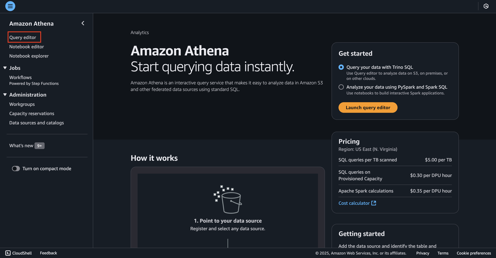
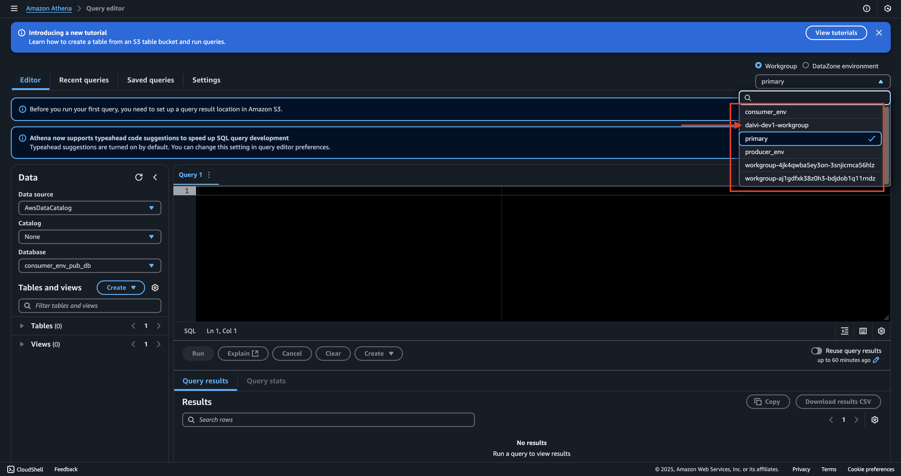
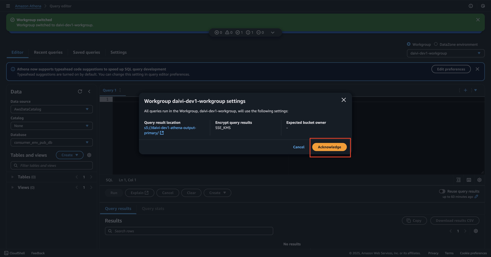
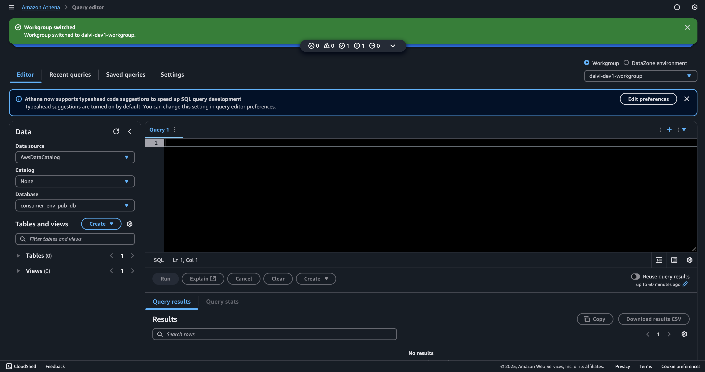
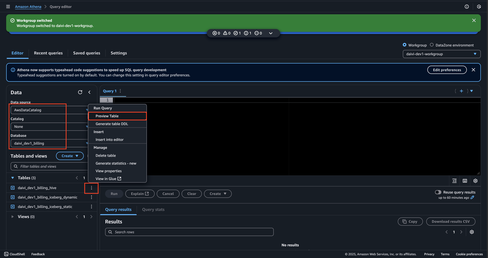
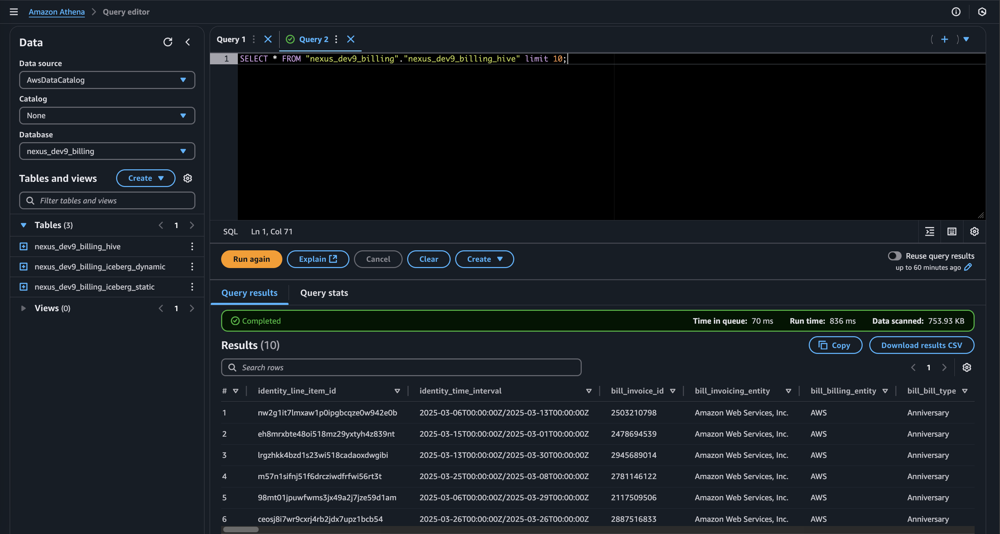
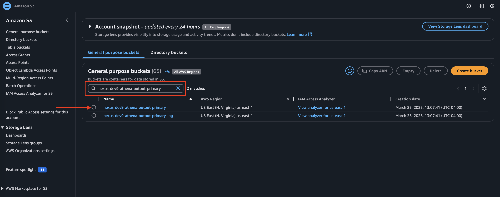
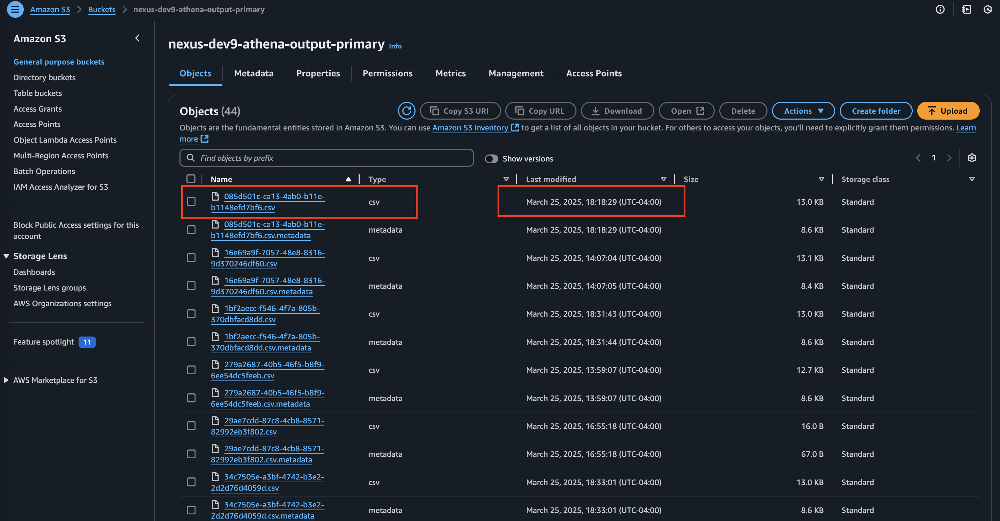
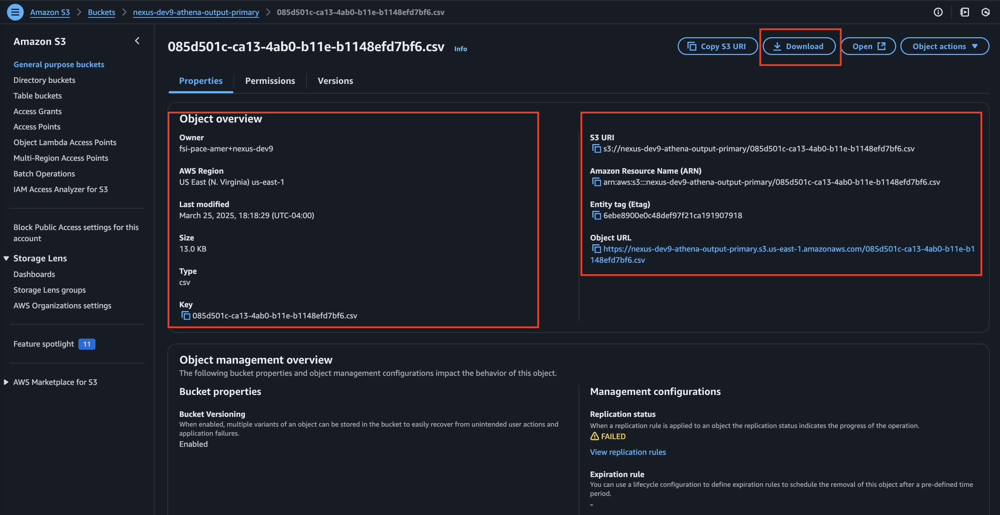
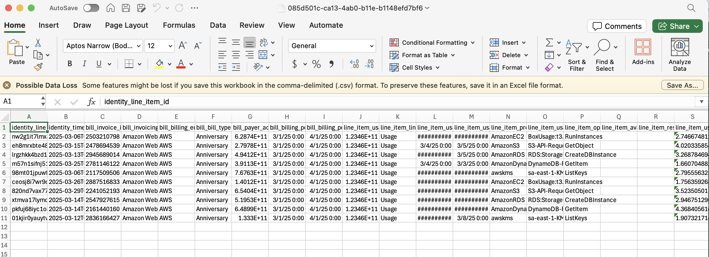

# Exploring Amazon Athena in DAIVI

This guide walks you through the Amazon Athena implementation in your DAIVI environment. Our deployment enables data exploration and analysis capabilities through Athena's serverless query service.

## Understanding Your Amazon Athena Deployment

When you first access Amazon Athena, you'll see:
- Main Dashboard Features:
  - Query editor for SQL analysis
  - Notebook editor for Spark applications
  - Left navigation panel for accessing different tools and settings
- Getting Started Options
- Pricing Overview (US East)

Navigate to "Query Editor" to view Athena workgroup and query datasets



### Dashboard Overview

#### Selecting workgroup 
When you access Amazon Athena in the AWS Console, the default selected workgroup will be `primary`.
- Select `daivi-{environment-name}-workgroup` to switch into our created workgroup with necessary IAM permissions to access our data catalog.
- Once the workgroup is switch, select "Acknowledge" to confirm the S3 result location of our query
- This s3 bucket will be the location where you find your query result history. We will demo how to query in athena and view stored results in the output bucket in the below step. 





Within a workgroup, you will see: 
- A query editor interface for writing and executing SQL queries
- Database and table navigation panel on the left
- Query history and saved queries section
- Results visualization options
- Settings panel showing workgroup configurations and query output locations



### Demo: Querying Data Catalog in Athena 
Your Athena data catalog has been configured during deployment. In the "Data Sources" section, you can view:
- Available databases and tables
- Table schemas and properties
- Data source connections
- Storage locations in S3
- Partitioning information where applicable

In our demo, we will query and view the result of our **billing hive** table from the root data catalog. 

To get started with our demo, first select our data catalog as the following: 
```
Data source: AWSDataCatalog
Catalog: None
Database: daivi_{environment-name}_billing 
Table: daivi_{environment-name}_billing_hive
```
Expand the gear selection next to `daivi_{environment-name}_billing_hive` table, and select "Preview Table". 



The query console will be automatically executed the following query in a new query tab: 
```
SELECT * FROM "daivi_{environment-name}_billing"."daivi_{environment-name}_billing_hive" limit 10;
```
If you do not see your query automatically run, click "Run" to view the results.

You can view the results under "Results" section. You can also "Copy" or "Download results CSV"



Next, we will inspect the result output in our S3 output bucket. 
- On the top search bar, search for "S3"
- In the S3 homepage, you would see all the created buckets of our project 
- In the "Find buckets by name", search and select `daivi-{environment-name}-athena-output-primary`



- Within the named bucket, you will see all the results of your athena queries
- Inspect on the "Last Modified" date, and select the csv file corresponding query you made to review its saved results



- Review the S3 URI, ARN, object key, and object URL for reference (if you need to refer the resource information in other services)
- Select "Download"



- The data of your downloaded file should be identical with the result of the query you saw earlier in Athena console



## Reference Information
- Related IaC: `iac/roots/athena`
---

*Note: This guide focuses on navigating and understanding your deployed Athena configuration. For any changes to the configuration, please refer to the Infrastructure as Code documentation and follow the established change management process.*
