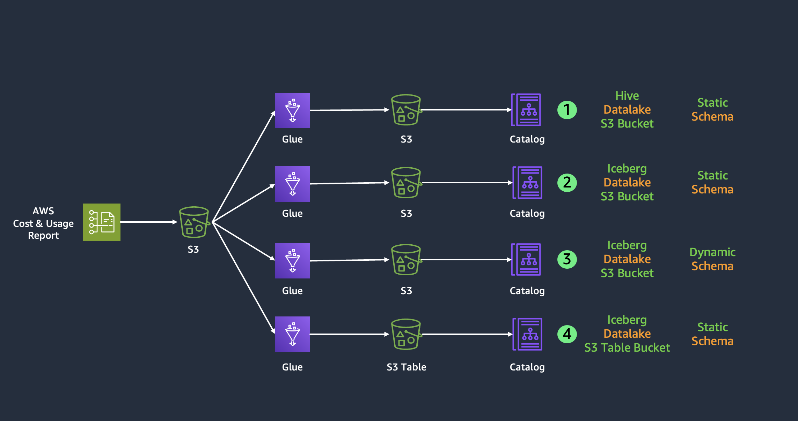
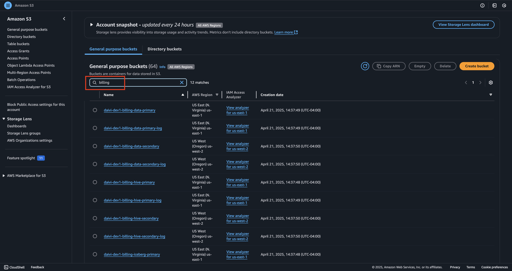
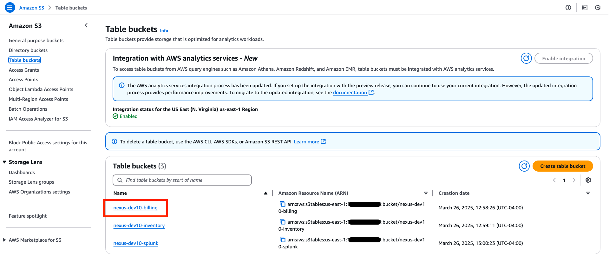
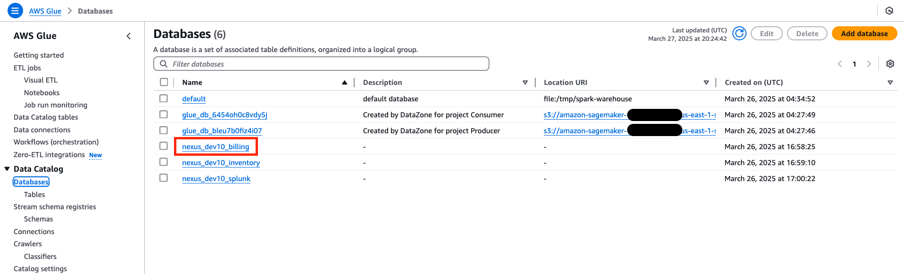
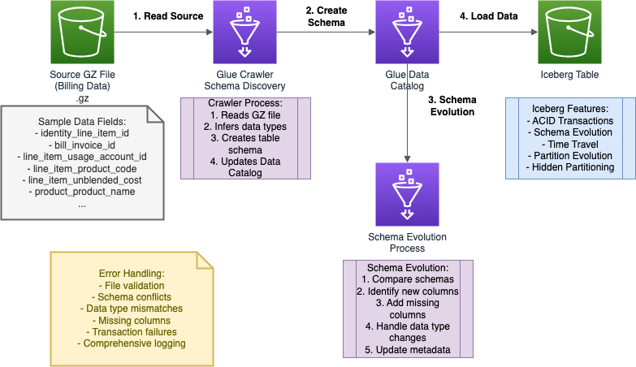

# Exploring the Billing Module in DAIVI

This guide walks you through the Billing Datalake implementation in your DAIVI environment. The code can be found at (`iac/roots/datalakes/billing`).

## Billing Use Case

### High-level Overview
The Billing Architecture components include:
- An S3 bucket for cost and usage reports
- An S3 bucket in Iceberg format for cost and usage reports
- An S3 table bucket for cost and usage reports
- A Glue database for cost and usage reports, with tables for CSV and Iceberg formats
- Various Billing Glue ETL jobs
- An Athena workgroup for querying data in Glue databases, S3 buckets, and S3 table buckets

### S3 Buckets
If you navigate to S3 in the AWS Console and search for "billing", you'll see all of the associated buckets for billing:
- daivi-var-billing-data-primary: A standard S3 bucket for cost and usage reports
- daivi-var-billing-hive-primary: Stores data from cost and usage file into a hive table so that it is queriable from Athena
- daivi-var-billing-iceberg-primary: Stores cost and usage reports in Iceberg format
- Various associated logging and secondary buckets

### S3 Table Bucket
On the S3 service page, if you nagivate to table buckets, you'll see the associated table bucket for billing:
daivi-var-billing: An S3 table bucket, that stores cost and usages reports in an Iceberg table

### Glue Databases
Navigate to the Glue Service console, select "Databases" on the left hand side, and you'll see the associated database for billing:
- daivi-var-billing: The billing database which has tables for our CSV and Iceberg formats

### Glue ETL Jobs
Navigate to "ELT Jobs" in the Glue Service console. Search for "billing" and you will see the associated Glue ETL jobs: 
- daivi-var-billing-s3table-create: Creates a namespace in our S3 table bucket if it doesn't exists, defines the table schema, and creates an empty table with a defined structure
- daivi-var-billing-s3table: Loads/transfers data from the source AWS Glue Data Catalog into an S3 table bucket
- daivi-var-billing-s3-table-delete: Deletes the Billing table from our S3 Table bucket and removes all table metadata from the Glue Data Catalog
- daivi-var-billing-iceberg-static: Processes static billing data from a CSV file and loads it into our S3 Table Bucket
- daivi-var-billing-hive: Loads S3 billing data into a Hive table so that the data can be queried from Athena

### Glue ETL Dynamic Job:
- daivi-var-billing-iceberg-dynamic: 
- Once a new report is generated and uploaded to the respective S3 bucket, Lambda triggers a Glue Workflow (`iac/roots/datalakes/billing/billing_workflow_trigger.py`) and passes the location of this new file. A Glue Workflow crawler infers the schema of that new file and creates a new table with this schema.
- Full Workflow for Billing Dynamic Job:
- find_crawler_created_table(TARGET_DATABASE_NAME, file_to_process)
    - Searches database for billing tables
    - Matches tables against file path components
    - Falls back to most recently created table
    - Returns billing table object (e.g., billing_c87fb293_1234_abcd_ef12_456789abcdef)
- load_data_from_crawler_table(glueContext, TARGET_DATABASE_NAME, crawler_table_name)
    - Attempts to load using DynamicFrame from catalog
    - Falls back to direct file reading if needed:
    - CSV with header=true if CSV file
    - Parquet format as default
    - Returns and caches Spark DataFrame for performance
- Check existing target table
    - reset_iceberg_table_if_needed(TARGET_DATABASE_NAME, ICEBERG_TABLE_NAME, drop_if_exists=False)
    - By default keeps existing table (drop_if_exists=False)
- Compare source and target schemas
    - target_df = spark.sql(f"SELECT * FROM {TARGET_DATABASE_NAME}.{ICEBERG_TABLE_NAME} LIMIT 0")
    - Identifies missing columns (in target but not in source)
    - Adds missing columns to source with NULL values of correct type
    - Finds new columns (in source but not in target)
- Add new columns to target schema
    - For each new column:
    - Determines SQL data type using get_sql_type() function
    - Issues ALTER TABLE statement:
        - ALTER TABLE dev_us_billing_iceberg_dynamic ADD COLUMN new_col_name STRING
    - Falls back to dropping columns if ALTER fails
- Write data to Iceberg table
    - For existing table:
    - APPEND mode with schema merging enabled
    - .option("merge-schema", "true")
- Handle metadata errors (if any)
    - If error contains "metadata" or "incompatible"
    - Attempts to recreate table:
    - Drops existing table completely
    - Creates new one in OVERWRITE mode
    - .option("write-format", "parquet")
- Clean up temporary resources
    - delete_crawler_created_table(TARGET_DATABASE_NAME, crawler_table_name)
    - Removes the crawler-created table from Glue catalog
- Log job summary
    - Data source file
    - Tables processed
    - Row and column counts
    - Lists schema changes made
- job.commit()

---

*Note: This guide focuses on navigating and understanding your deployed Billing configuration. For any changes to the configuration, please refer to the Infrastructure as Code documentation and follow the established change management process.*

