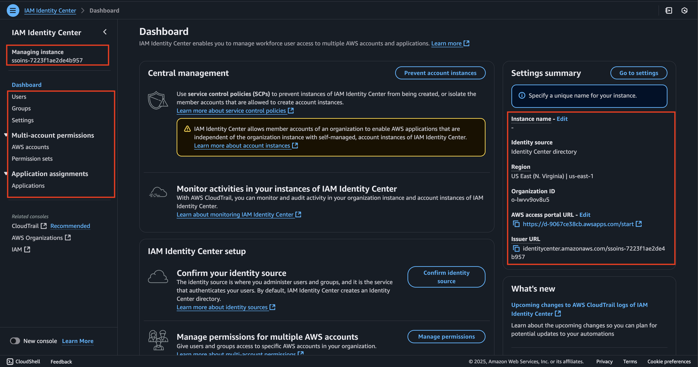
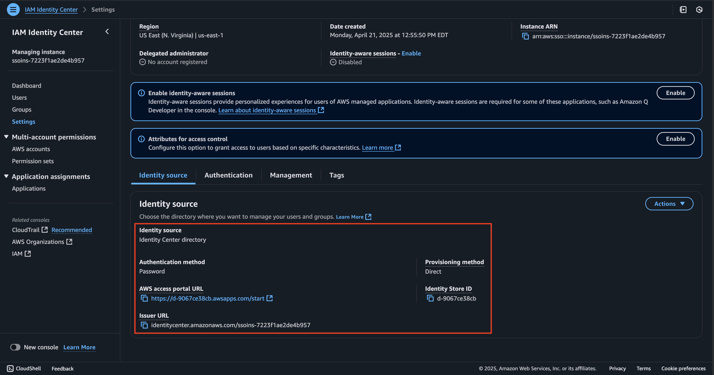
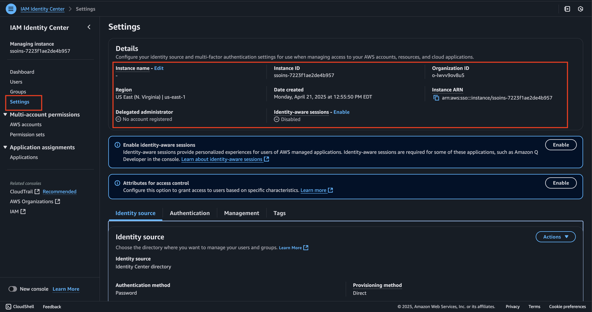
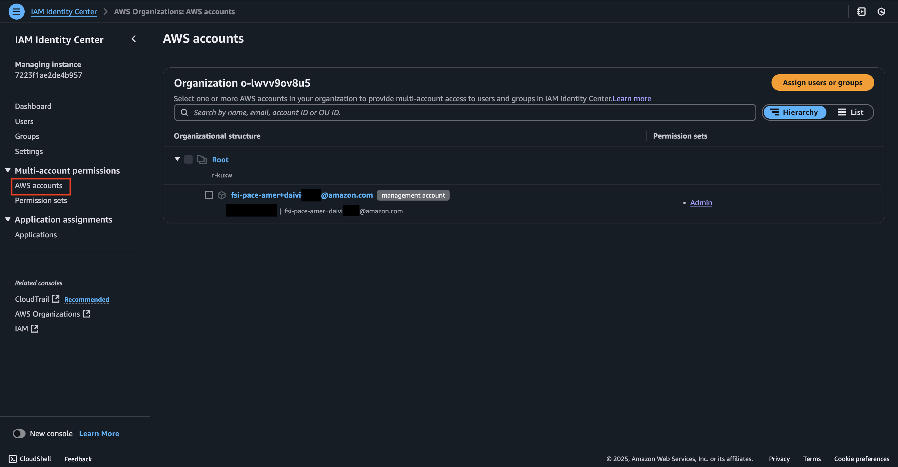
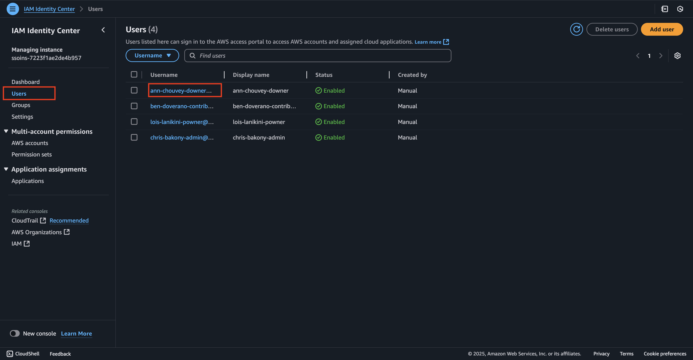
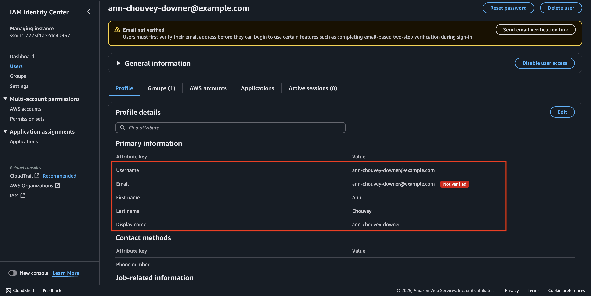
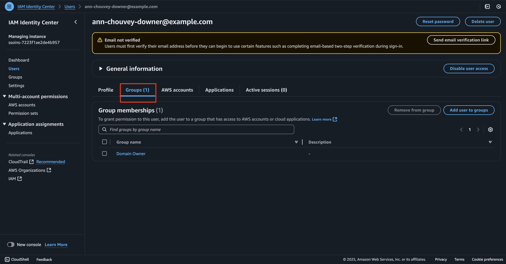
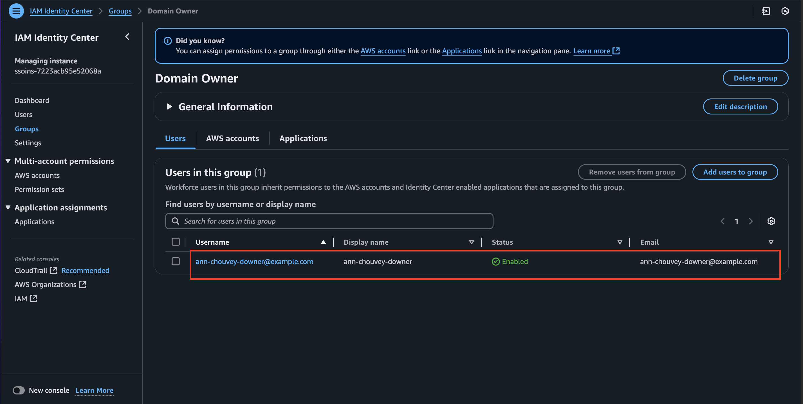

# Exploring IAM Identity Center in DAIVI

This guide walks you through the IAM Identity Center implementation in your DAIVI environment. Our deployment implements IAM Identity Center at the organization level (`iac/roots/idc/idc-org`), though an account-level implementation (`iac/roots/idc/idc-acc`) is also available in the codebase.

## Understanding Your IAM Identity Center Deployment

### Dashboard Overview
When you access IAM Identity Center in the AWS Console, you'll see a dashboard displaying:
- A left sidebar menu for navigation (Users, Groups, Settings, etc.)
- Central management section highlighting Service Control Policies (SCPs)
- Monitoring activities information using AWS CloudTrail
- IAM Identity Center setup options
- Settings summary (right panel) showing key details like Region, Organization ID, Access Portal URL, and Issuer URL 
- We highlight the important component of the dashboard in the attached example 

### Identity Source Configuration
Your identity source has been configured during deployment. In the "Settings > Identity source" section, you can view:
- Basic identity source settings (directory type and authentication method)
- Access portal and issuer URLs for user sign-in
- Identity Store ID and provisioning details
- General instance information (ID, region, creation date)

### Examining Deployed Permission Sets
Navigate to "Permission sets" to view the pre-configured access levels. You will find four permission sets we have created for our SageMaker Unified Studio personas:
- DomainOwner: For domain management access
- Admin: For full administrative permissions
- ProjectContributor: For read-only project access
- ProjectOwner: For project management responsibilities

Each permission set displays its name, description, and associated ARN. You can search and sort these permission sets using the search bar, and create new ones using the "Create permission set" button.

### AWS Account Assignments
Under "AWS accounts", you can explore:
- The organizational structure of your AWS accounts
- A hierarchical view of accounts, starting with the Root account
- Management accounts within the organization
  - In our case, it is our AWS root account `xyz-daivi-dev1@xyz.com`
- Associated permission sets for each account
  - In our case, it is `Admin`
- Options to assign users or groups to specific accounts
- Search functionality to find accounts by name, email, account ID, or OU ID
- The ability to switch between Hierarchy and List views

## Working with Existing Users and Groups

### Viewing User Directory
In the "Users" section, you can:
- View all provisioned users
  -   We created four users corresponding to four personas  
- Check individual user details: 
  - In this example, we will expand information created for our domain owner 
- Monitor user status
- See group memberships

### Understanding Group Structure
The "Groups" section shows:
- Implemented group hierarchy
- Group memberships 
  - When we expand each of the group, we can see the user reside in each group 
  - In our example, we can see that within `Domain Owner` group we can see `Sarah`
- Associated permission sets

## Important Notes
- This deployment uses organization-level IAM Identity Center (`idc-org`)
- All configurations are managed through Infrastructure as Code
- Changes should be made through the IaC pipeline, not directly in the console
- The console should be used primarily for viewing and monitoring

## Available Actions
While configurations are managed through IaC, you can still:
- Monitor user and group activities
- View permission assignments
- Access audit logs
- Generate reports
- Troubleshoot access issues

## Reference Information
- Related IaC: `iac/roots/idc/idc-org`
- Alternative Account-Level Implementation: `iac/roots/idc/idc-acc`

---

*Note: This guide focuses on navigating and understanding your deployed IAM Identity Center configuration. For any changes to the configuration, please refer to the Infrastructure as Code documentation and follow the established change management process.*
