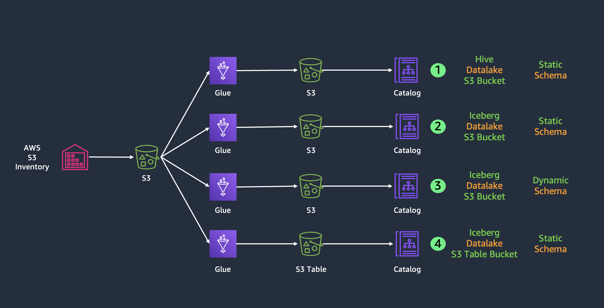
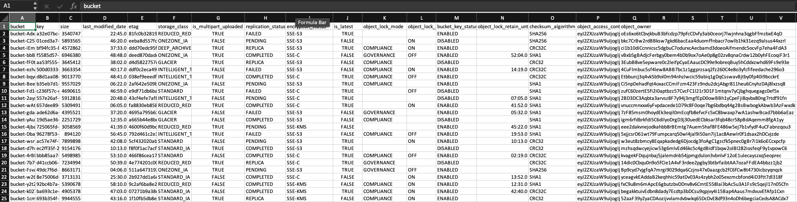
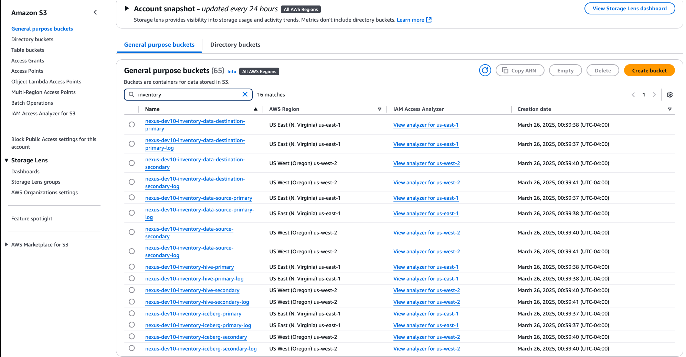
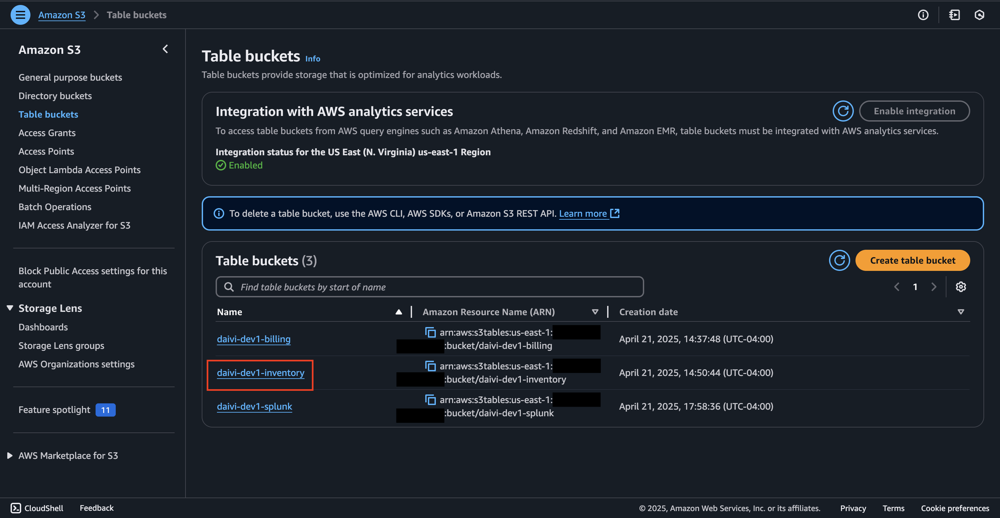
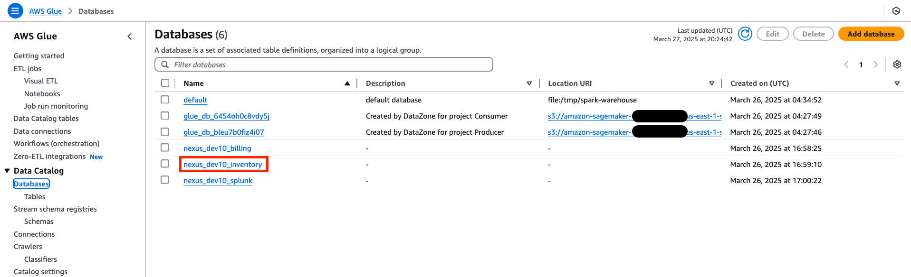
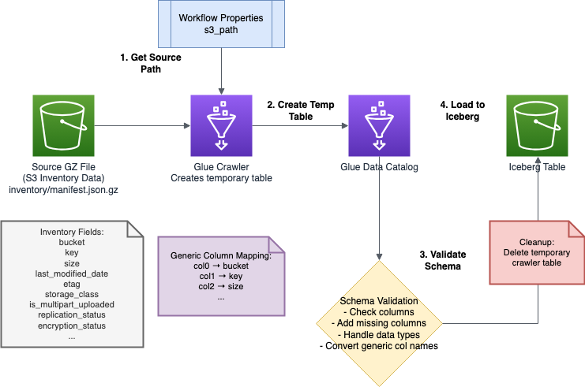

# Exploring the Inventory Module in DAIVI

This guide walks you through the Inventroy Datalake implementation in your DAIVI environment. The code can be found at (`iac/roots/datalakes/inventory`).

## Inventory Use Case

### High-level Overview
The Inventory Architecture components include:
- A source S3 bucket for which the Inventory reports will be derived from
- A destination S3 bucket for Inventory reports
- An S3 bucket in Iceberg format for Inventory reports
- An S3 table bucket for inventory reports
- A Glue database for inventory reports, with tables for CSV and Iceberg formats
- Various Inventory Glue ETL jobs
- An Athena workgroup for querying data in Glue databases, S3 buckets, and S3 table buckets

### S3 Inventory Reports
S3 Inventory reports provide a scheduled list of your objects and their metadata in an S3 bucket. They help you manage storage, audit object properties, and verify encryption status by generating daily or weekly CSV/ORC/Parquet files containing details about your objects' size, timestamps, tags, and other attributes. S3 Inventory reports are useful for a number of use cases including storage management, compliance & security validation, cost optimization, and more. 
- Example S3 Inventory Rport

### S3 Buckets
If you navigate to S3 in the AWS Console and search for "inventory", you'll see all of the associated buckets for inventory:
- daivi-var-inventory-data-source-primary: A standard S3 bucket storing various documents that is configured to produce S3 inventory reports
- daivi-var-inventory-data-destination-primary: A standard S3 bucket where our inventory reports are sent
- daivi-var-inventory-hive-primary: Stores data from our inventory file into a hive table so that it is queriable from Athena
- daivi-var-inventory-iceberg-primary: Stores our inventory reports in Iceberg format
- Various associated logging and secondary buckets

### S3 Table Bucket
On the S3 service page, if you nagivate to table buckets, you'll see the associated table bucket for inventory:
-daivi-var-inventory: An S3 table bucket, that stores inventory reports in an Iceberg table

### Glue Databases
Navigate to the Glue Service console, select "Databases" on the left hand side, and you'll see the associated database for inventory
- daivi-var-inventory: The inventory database which has tables for our CSV and Iceberg formats

### Glue ETL Jobs
Navigate to "ELT Jobs" in the Glue Service console. Search for "inventory" and you will see the associated Glue ETL jobs. 
- daivi-var-inventory-s3table-create: Creates a namespace in our S3 table bucket if it doesn't exists, defines the table schema, and creates an empty table with a defined structure
- daivi-var-inventory-s3table: Loads/transfers data from the source AWS Glue Data Catalog into an S3 table bucket
- daivi-var-inventory-s3-table-delete: Deletes the Inventory table from our S3 Table bucket and removes all table metadata from the Glue Data Catalog
- daivi-var-inventory-iceberg-static: Processes static inventory data from a CSV file and loads it into our S3 Table Bucket
- daivi-var-inventory-hive: Loads S3 inventory data into a Hive table so that the data can be queried from Athena

### Glue ETL Dynamic Job:
- daivi-var-inventory-iceberg-dynamic: 
- Once a new report is generated and uploaded to the respective S3 bucket, Lambda triggers a Glue Workflow (`iac/roots/datalakes/inventory/inventory_workflow_trigger.py`) and passes the location of this new file. A Glue Workflow crawler infers the schema of that new file and creates a new table with this schema.
- Full Workflow for Inventory Dynamic Job:
- find_crawler_created_table(TARGET_DATABASE_NAME, file_to_process)
    - Gets all tables in database using boto3.client('glue').get_tables
    - Filters out the Iceberg table ({APP_NAME}_{ENV_NAME}_inventory_iceberg_dynamic)
    - Uses regex to find tables with UUID patterns
    - Falls back to matching UUID extracted from file path
    - Returns table object (e.g., inventory_c87fb293_1234_abcd_ef12_456789abcdef)
- load_data_from_crawler_table(glueContext, TARGET_DATABASE_NAME, crawler_table_name)
    - First attempts DynamicFrame approach:
        - glueContext.create_dynamic_frame.from_catalog(database, table_name)
    - Falls back to direct file reading if DynamicFrame fails:
    - CSV with options(header=true, inferSchema=true)
    - Parquet format as default
    - Returns and caches Spark DataFrame for better performance
    - Logs row count and column details
- Check for generic columns because inventory reports do not generate headers so we need to check for that and add them if it is the case.
    - Detects generic column names (col0, col1, col2...)
    - If column count matches S3 inventory schema (19 columns):
    - Maps generic columns to S3 inventory names:
        - bucket, key, versionid, islatest, isdeletemaker, etc.
    - Logs schema before and after renaming
- Prepare Iceberg table
    - Calls reset_iceberg_table_if_needed(TARGET_DATABASE_NAME, ICEBERG_TABLE_NAME)
    - Checks if table exists but doesn't drop it by default
- Compare source and target schemas
    - Gets existing schema via SQL:
        - SELECT * FROM {TARGET_DATABASE_NAME}.{ICEBERG_TABLE_NAME} LIMIT 0
    - Identifies columns in target not present in source
    - Adds those columns to source with NULL values of matching type
    - Finds columns in source that are new (not in target)
- Add new columns to target
    - For each new column:
    - Determines SQL data type using get_sql_type() function
    - Issues ALTER TABLE statement:
        - ALTER TABLE {TARGET_DATABASE_NAME}.{ICEBERG_TABLE_NAME} ADD COLUMN new_col_name STRING
    - Falls back to dropping columns if ALTER TABLE fails
-  Write to Iceberg table
    - If table exists:
    - APPEND mode with schema merging enabled
    - .option("merge-schema", "true")
    - .option("write-format", "parquet")
    - If new table:
    - OVERWRITE mode to create fresh table
- Handle metadata errors
    - Catches errors containing "metadata" or "incompatible" keywords
    - If error occurs:
    - Drops existing table completely
    - Creates new table with fresh metadata in OVERWRITE mode
- Clean up resources
    - delete_crawler_created_table(TARGET_DATABASE_NAME, crawler_table_name)
    - Safety check ensures it never deletes the Iceberg table itself
- Generate job summary
    - Logs key metrics and operations performed:
    - Source file processed
    - Crawler table name
    - Target Iceberg table
    - Row/column counts
    - List of new/missing columns processed
- job.commit()

---

*Note: This guide focuses on navigating and understanding your deployed Inventory configuration. For any changes to the configuration, please refer to the Infrastructure as Code documentation and follow the established change management process.*
