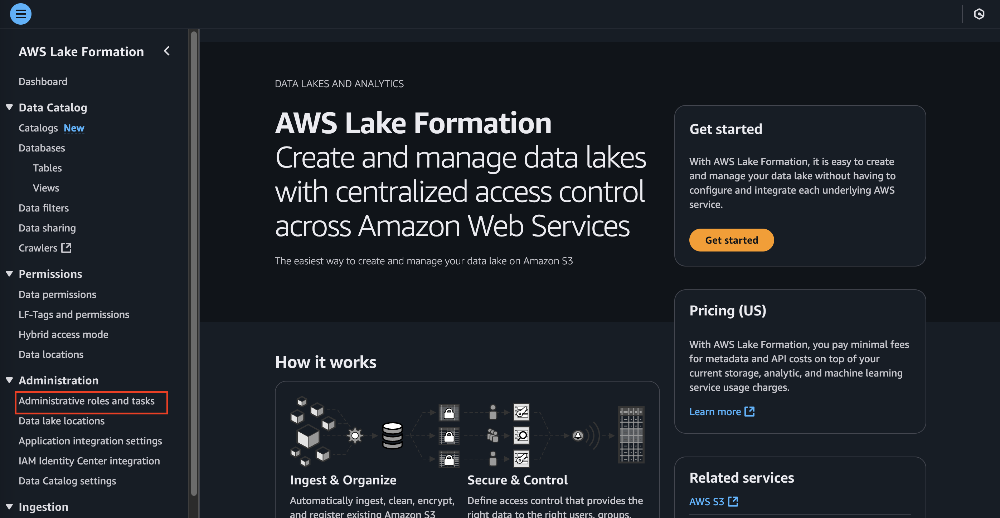
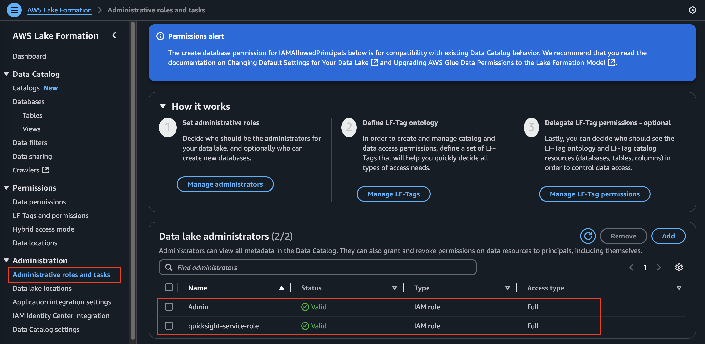
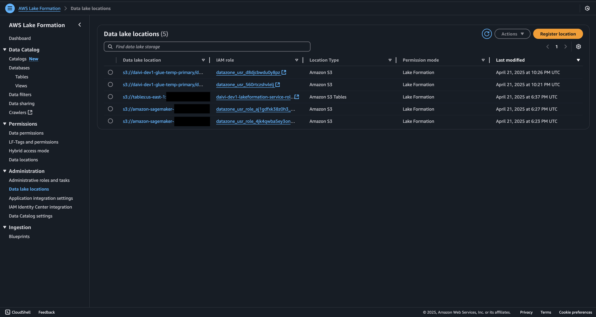
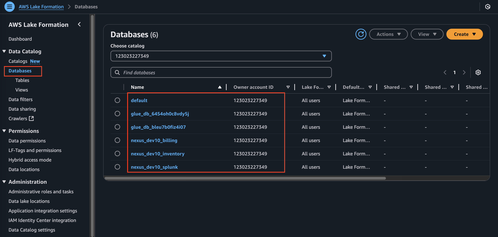
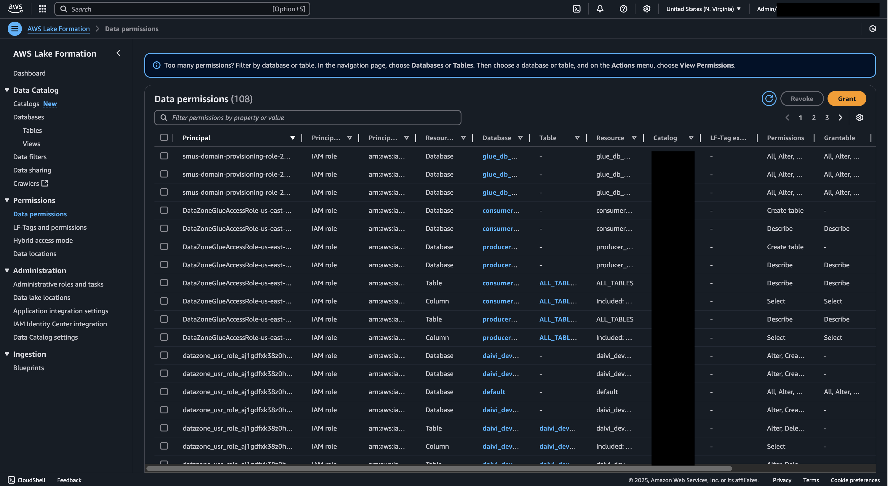

# Exploring AWS Lake Formation Components

## Overview
This guide walks through the AWS Lake Formation components and configurations that are automatically set up after deploying the solution using our Infrastructure as Code (IaC). You'll learn about the key components created and how they work together to provide a secure and managed data lake environment.

## Prerequisites
- Successfully deployed the solution using the provided Makefile
- Access to AWS Console with appropriate permissions
- Understanding of basic data lake concepts

## Overview of Components Created After Deployment

### 1. Data Lake Settings
Navigate to AWS Lake Formation console to see the following configurations:
- Database and table default permissions
- IAM user and role permissions
- Data lake administrators
- Data lake locations

### 2. Data Lake Locations
After deployment, you'll find:
- Registered S3 buckets as data lake locations
- Storage configurations for different data types
- Access points and permissions

### 3. Data Catalog
The following components will be available in your AWS Glue Data Catalog:
- Databases created for your data lake
- Tables representing your data structure
- Schemas and metadata configurations

### 4. Security Configuration
Your deployment includes:
- Lake Formation permissions
- Resource access controls
- Cross-account access settings
- LF-Tags for resource organization

### 5. Data Access
You can observe:
- Configured access points for different user roles
- Query access through Amazon Athena
- Integration with other AWS analytics services

## Understanding Your Lake Formation Deployment

### 1. Check Lake Formation Settings
1. Go to AWS Lake Formation console
2. Navigate to "Administrative roles and tasks"

3. Verify:
    - Data lake administrators are properly set:
      - `Admin` and `quicksight-service-role` should be added
      - `Admin` would give necessary access to all data catalogs for athena query 
      - `quicksighr-service-role` would give quicksight necessary access to all data catalogs 
    - Default permissions are configured
      - `IAMAllowedPrinciples` should be added
    - Database creators are defined
      - `IAMAllowedPrinciples` should be added

### 2. Verify Data Locations
1. In Lake Formation console, go to "Data lake locations"
2. Confirm:
    - S3 buckets are registered
    - Permissions are correctly assigned
    - Storage lifecycle policies are in place

### 3. Review Data Catalog
1. Navigate to "Databases"
2. Verify:
    - Expected databases are present
    - Table definitions are accurate
    - Column-level permissions are set

### 4. Validate Security Settings
1. Check "Data Permissions"
2. Confirm IAM roles have appropriate access (e.g. have the right data access level of relevant catalog). Key things to check:
- SageMaker Unified Studio service role 
- Datazone service role 
- Glue service role 
- QuickSight service role 
- Quicksight user ARN 

## Best Practices
- Regularly review permissions
- Monitor data access patterns
- Maintain documentation of configurations
- Follow least privilege principle
- Implement proper tagging strategy

## Reference Information
- Related IaC: `iac/roots/foundation/iam-roles`
- Other related CLI commands for granting lake formation access as part of the deployment steps 
---

*Note: This guide focuses on navigating and understanding your deployed Lake Formation configuration. For any changes to the configuration, please refer to the Infrastructure as Code documentation and follow the established change management process.*
