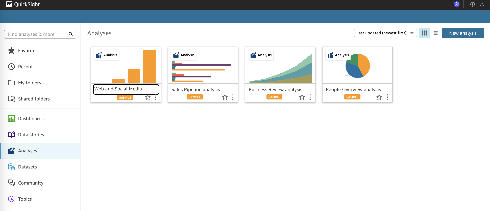
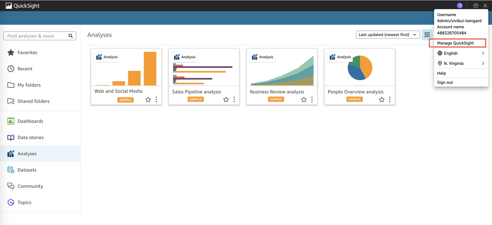
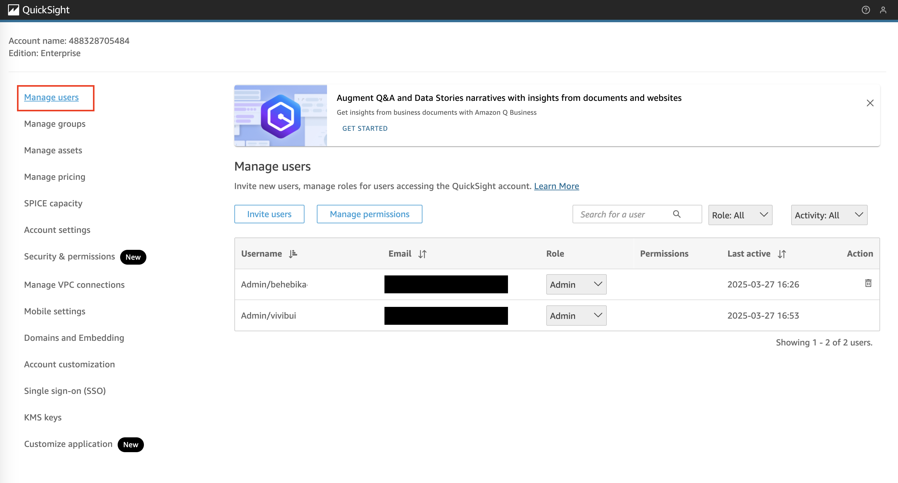
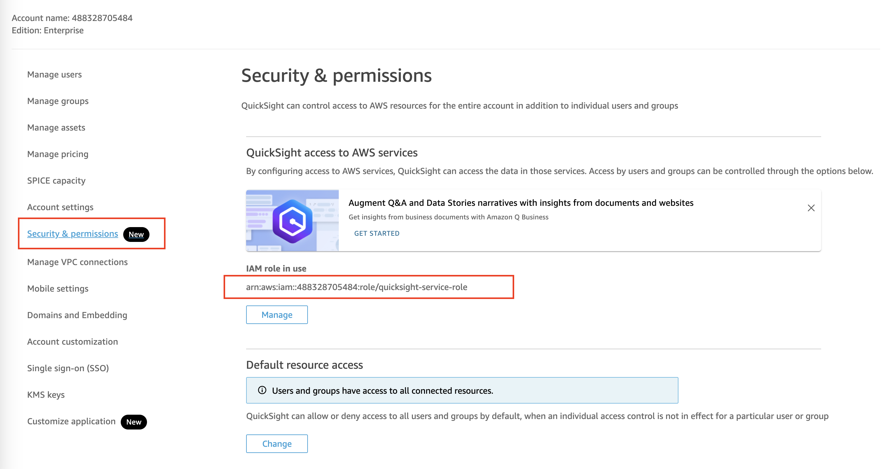
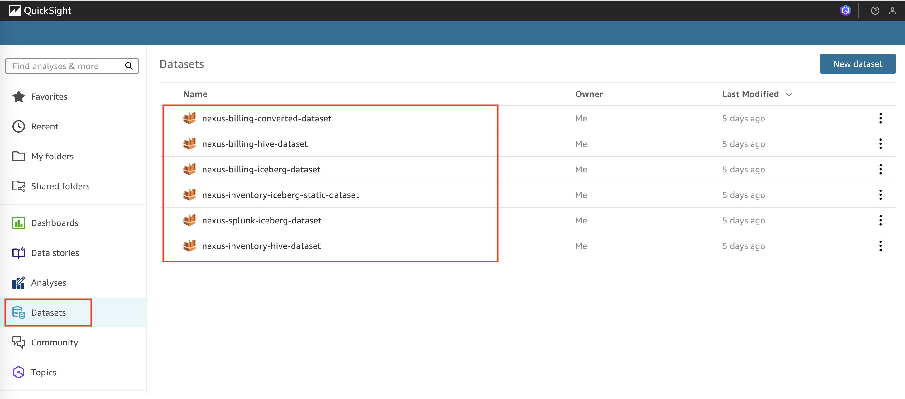
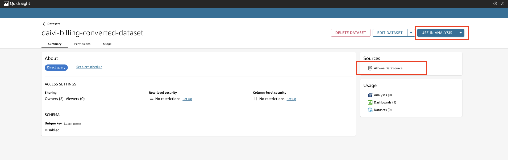
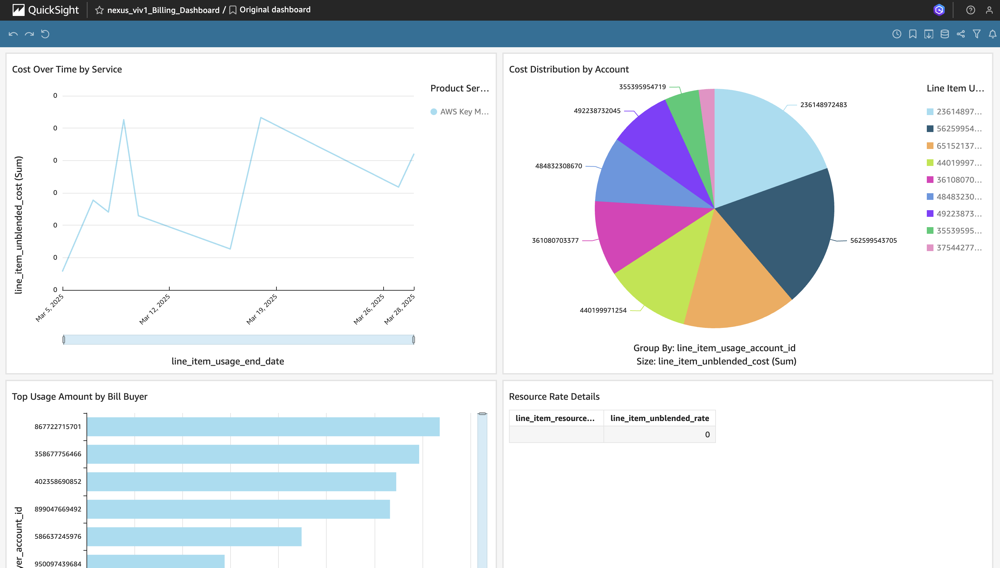

# Exploring Amazon QuickSight

## Overview
After deploying the solution, Amazon QuickSight is configured to provide visual analytics and business intelligence capabilities. This guide walks through the QuickSight components and dashboards that are automatically set up through our Infrastructure as Code (IaC).

## Prerequisites
- Successfully deployed the solution using the provided Makefile
- Access to AWS Console with appropriate permissions

## Understanding your QuickSight deployment 

If you are the root account user or received invitation to join from the root account user: 
1. Navigate to Amazon QuickSight console
2. You should see the pre-configured dashboards and datasets

**Notes**: 
- In the current IaC, our root account user does not need to enter their email for first sign-in since we have automatically assigned the email value of `{account-id}@{app-name}.com`
- You can adjust this default email value in `quicksight/subscription/terraform.tfvars` > `EMAIL`
- For users who joined through invitation, the invite owner has to enter the email of invitee in the invitation, which eliminate the need of invitee to enter their email when first logged in

If you are added to the AWS account as Admin or role with relevant Admin access to QuickSight:
1. Navigate to Amazon QuickSight console
2. Enter your email address, then click "Submit"
3. You should see the pre-configured dashboards and datasets

Image: Pre-configured QuickSight initial view when logged in 

## Data Sources
After deployment, you'll find the following data sources configured:

### 1. User Access and IAM Configuration 
- Preconfigured permissions and access roles
  - Navigate to "Profile" on the top right corner > "Manage QuickSight"
  
  
  - In "Manage Users", review the list of users with access
  
    
  - In "Security & Permissions", you can review all your access resource configuration
  - Make sure that you have selected `quicksight-service-role` as the IAM role in use
  - This service role has configured Athena, S3, and IAM as allowed resources 
    
  
- Continue to explore the remaining of available settings on your own preference

### 2. Datasets
- Navigate to "Profile" on the top right corner > "Manage QuickSight"
- The following datasets are automatically created by QuickSight:
    - Customer Analytics Dataset
    - Sales Performance Dataset
    - Operational Metrics Dataset

- Our datasets created through IaC are the following:
 

- To review the dataset's information (datasource, data security, schema, and usage), click on a dataset:
  **Notes**:
- `converted-dataset` is the view created from our custom SQL query to Athena. This query helps cast the string values in billing hive table into correct datatype (decimal, bigint, or date type)
- Detail of the used SQL query can be found as part of our code in `quicksight/dataset/main.tf`

- In the dataset information, noted that the selected Data source is Athena 
- To start a data analysis, select "Use In Analysis"

## 3. Pre-built Dashboard
- In the homepage of our QuickSight, navigate to "Dashboards"
- You can see that our dashboard built by IaC is deployed 

## Next Steps
Try out on the QuickSight console the following: 
- Creating custom analyses
- Building new dashboards
- Setting up automated reports
- Configuring alerts
- Bonus: You can test Q capabilities (data stories, analysis suggestion, or dashboard insight suggestion) by enabling Pro version of your account

## Reference Information
- Related IaC: `iac/roots/quicksight`
---

*Note: This guide focuses on navigating and understanding your deployed QuickSight configuration. For any changes to the configuration, please refer to the Infrastructure as Code documentation and follow the established change management process.*
