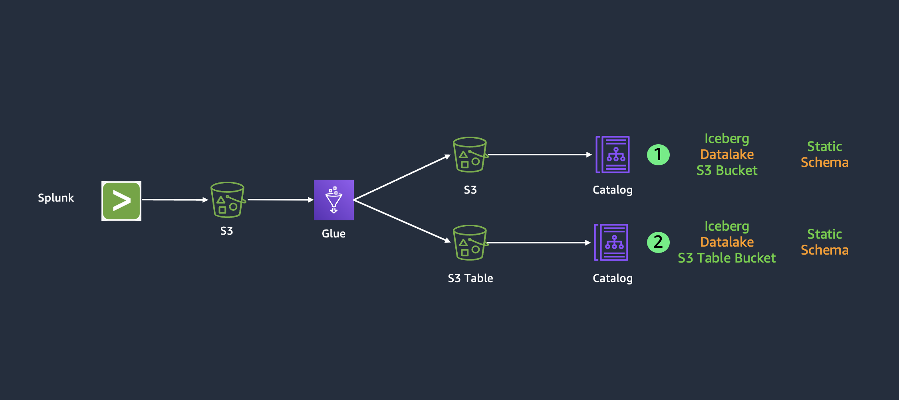
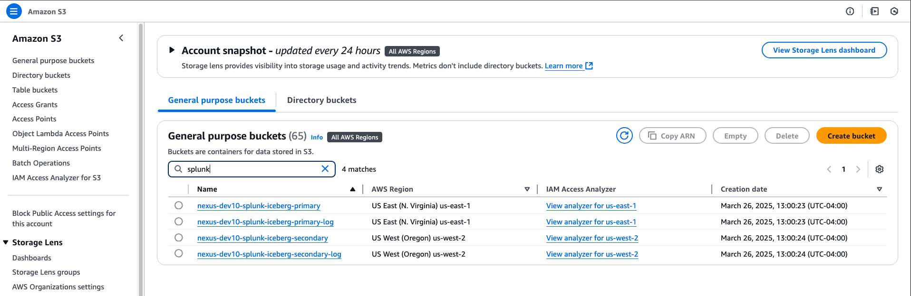
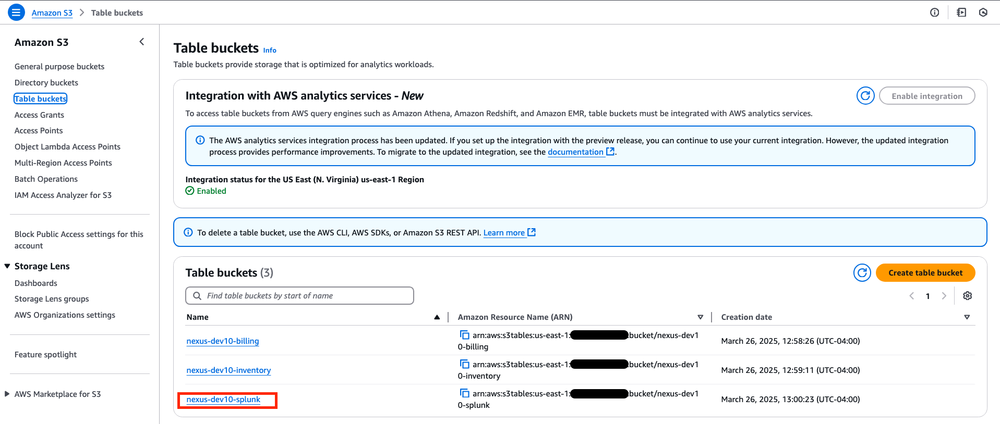

# Exploring the Splunk Module in DAIVI

This guide walks you through the Splunk Datalake implementation in your DAIVI environment. The code can be found at (`iac/roots/datalakes/splunk`).

## Splunk Use Case

### High-level Overview
The Splunk Architecture components include:
- An S3 bucket for Splunk data
- An S3 bucket in Iceberg format for Splunk data
- An S3 table bucket for Splunk
- A Glue database for Splunk data, with tables for our regular and Iceberg formats
- Various Splunk Glue ETL jobs
- An Athena workgroup for querying data in our Glue databases, S3 buckets, and S3 table buckets

### S3 Buckets
If you navigate to S3 in the AWS Console and search for "splunk", you'll see all of the associated buckets for splunk:
- daivi-var-splunk-iceberg-primary: Stores our Splunk data in Iceberg format
- Secondary and logging buckets

### S3 Table Bucket
On the S3 service page, if you nagivate to table buckets, you'll see the associated table bucket for Splunk:
-daivi-var-splunk: An S3 table bucket, that stores Splunk data in an Iceberg table

### Network Infrastructure
Details on VPC setup for Splunk Instance:
- Private subnets for Splunk EC2 instance
- Security Group: aws_security_group.splunk
    - Allows inbound traffic on port 8089 from Glue security group only
    - Allows outbound traffic to all destinations
- VPC Endpoints for AWS services
- No public internet access for Splunk (private subnet)

### Splunk EC2 Instance
Navigate to the EC2 Service console and you'll see the Splunk instance. Below are some details about the Splunk instance:
- Amazon Linux 2 instance with AMI selection
- IAM Instance Profile: var.SPLUNK_EC2_PROFILE_NAME
- No public IP address by default
- EC2 metadata service with IMDSv2 required
- Root volume:
- User data script:
    - Downloads and installs Splunk
    - Retrieves credentials from Secrets Manager
    - Configures Splunk for remote access on port 8089
    - Sets up Splunk to start on boot
- Data volume:
    - Separate EBS volume for Splunk data
    - KMS encrypted, mounted at /dev/sdf

### Secrets Manager Details for Splunk
- aws_secretsmanager_secret.splunk_credentials:
    - Stores username/password for Splunk
    - KMS encrytpted using secrets_manager_kms_key
    - Generated password via random_password resource
- Credentials access by:
    - Splunk EC2 instance via IAM role
    - Glue jobs via IAM role

### Glue Databases
Navigate to the Glue Service console, select "Databases" on the left hand side, and you'll see the associated database for billing
- daivi-var-billing: The billing database has a number of tables inside.....TODO

### Glue ETL Jobs
Navigate to "ELT Jobs" in the Glue Service console. Search for "billing" and you will see the associated Glue ETL jobs. 
- daivi-var-billing-s3table-create: Creates a namespace in our S3 table bucket if it doesn't exists, defines the table schema, and creates an empty table with a defined structure
- daivi-var-billing-s3table: Loads/transfers data from the source AWS Glue Data Catalog into an S3 table bucket
- daivi-var-billing-s3-table-delete: Deletes the Billing table from our S3 Table bucket and removes all table metadata from the Glue Data Catalog
- daivi-var-billing-iceberg-static: Processes static billing data from a CSV file and loads it into our S3 Table Bucket
- daivi-var-billing-hive: Loads S3 billing data into a Hive table so that the data can be queried from Athena

### Splunk ELT Job:
- Full Workflow for Splunk Job:
- Initialize Glue job context
    - SparkContext, GlueContext, Spark session
    - Disable SSL warnings (urllib3.disable_warnings())
    - Configure Spark for Iceberg timestamp handling
- Retrieve Splunk credentials
    - Get credentials from AWS Secrets Manager
    - Uses SPLUNK_SECRET_NAME argument to find secret
    - Parses credentials from SecretString (username/password)
- Create Splunk search job
    - Build search URL: https://{SPLUNK_HOST}:8089/services/search/jobs
    - POST request with search query:
        - "search index=_internal | table _time host source sourcetype"
    - Extract search job SID from response
- Poll for search completion
    - Enter wait loop checking search status
    - GET request to status URL with SID
    - Check isDone flag in response
    - Sleep 1 second between checks
- Fetch search results
    - GET request to results endpoint with SID
    - Request JSON output format
    - Parse response for results array
- Transform results to DataFrame
    - Create formatted_results list
    - Extract key fields from each result:
        - _time, host, source, sourcetype
    - Create Spark DataFrame from list
    - Convert _time string to timestamp:
        - df.withColumn("_time", F.to_timestamp("_time"))
- Write to Iceberg table
    - Use DataFrame writer API:
        - .format("iceberg")
        - .mode("append")
        - .saveAsTable("{TARGET_DATABASE_NAME}.{TARGET_TABLE_NAME}")
    - Table path includes aws_glue catalog
- Log completion statistics
    - Report number of records processed
    - Handle empty results case
- job.commit()

---

*Note: This guide focuses on navigating and understanding your deployed Splunk configuration. For any changes to the configuration, please refer to the Infrastructure as Code documentation and follow the established change management process.*

   
