# Domain Management in SageMaker Unified Studio

## Overview
After deploying our solution, you'll find two distinct domains: the SageMaker Unified Studio domain (`Corporate`) and the DataZone domain (`Exchange`). This guide walks through both domain implementations and their configurations.

## Prerequisites
- Successfully deployed the solution using the provided Makefile
- Access to AWS Console with appropriate permissions

## Accessing the Domains

### 1. Navigate to SageMaker Unified Studio Domain
- Log into AWS Console
- Navigate to SageMaker
- Select "Domains" from the left navigation panel

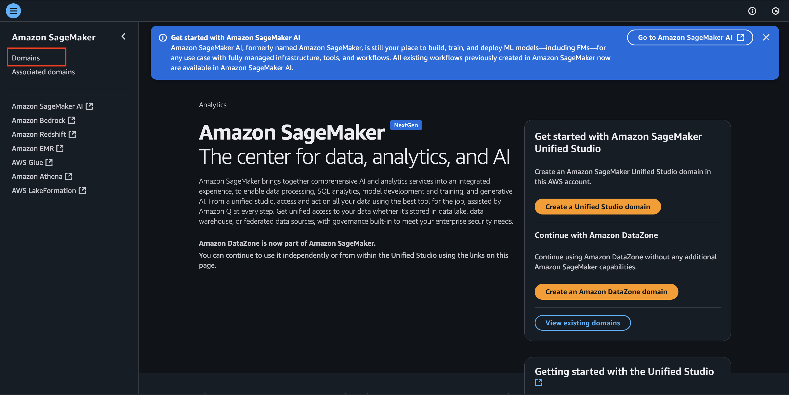

- You should be able to see `Corporate` and `Exchange` domain present
  - `Corporate` is the domain of SageMaker Unified Studio
  - `Exchange` is the domain of Datazone

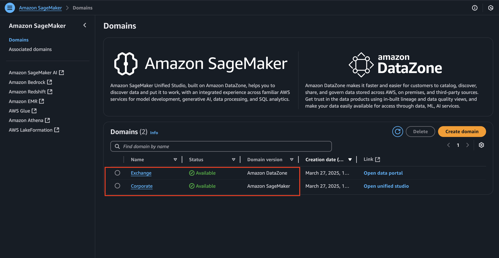

- Within the main domain view, you should be able to: 
  - Access your unique SageMaker Studio URL and Domain ARN
  - Configure user access through SSO or IAM
  - Set up project profiles with three pre-configured templates:
    - Full ML/AI development capabilities
    - Generative AI workflows
    - SQL analytics for data querying
  - View domain ARN and IAM Identity Center instance ARN
- Record the domain ARN (Amazon Resource Name) - you will need it later to log into the domain

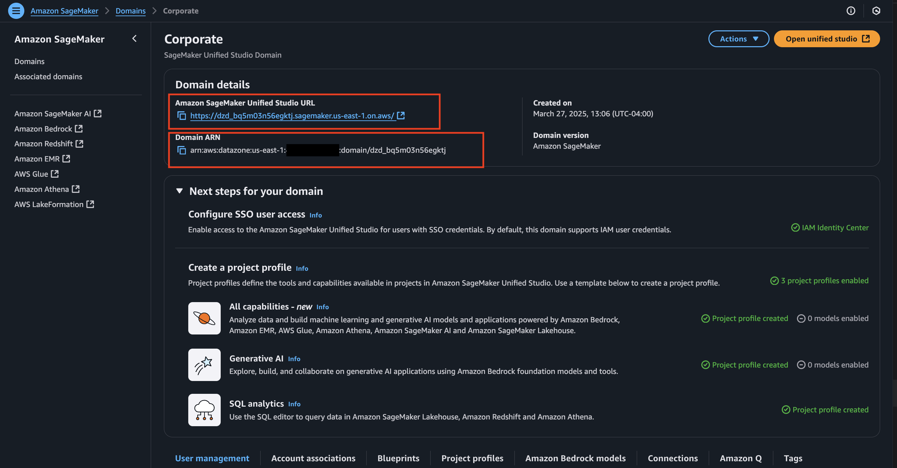
  
## SageMaker Unified Studio Domain (`Corporate`)

### 1. User Management

- We use IAM Identity Center (formerly AWS SSO) as the authentication provider for all users within a domain. When users access the Studio domain, they are authenticated through Single Sign-On (SSO), which validates their identity against IAM Identity Center
- Each user's permissions and access levels are determined by their assigned IAM Identity Center groups and permission sets
- This centralized authentication approach simplifies user management while maintaining security, as administrators can control access to Studio resources through IAM Identity Center's user and group management capabilities rather than managing individual IAM users or roles

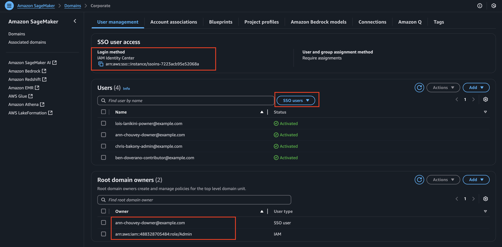

- To implement this integration with IAM Identity Center, it is important to have the Identity Center instance ARN defined as part of the creation of the domain 
- Within our implementation, we assign the root domain owners access for IAM Admin role and our users within the `Domain Owner` group of Identity Center
- Our IaC currently also iterate and provide access to all users in all Identity Center groups 

### 2. Other Domain Settings 
#### Account Association
Account Association allows you to share the SageMaker Studio domain across multiple AWS accounts within your organization. This enables cross-account collaboration while maintaining centralized management of resources and access controls. Users from associated accounts can access the domain using their IAM Identity Center credentials.

#### Blueprints
Blueprints are predefined templates that help you quickly set up and standardize project environments in SageMaker Studio. They contain configurations for common data science and ML workflows, including required dependencies, libraries, and resource settings. Blueprints ensure consistency across team projects and reduce setup time.

#### Project Profiles
Project Profiles define the default configurations and resources available to projects within the domain. They specify:
- Compute resources and instance types
- Storage allocations
- Default libraries and tools
- Security settings and access permissions
  These profiles help standardize project setups and ensure efficient resource utilization.

#### Amazon Bedrock Models
This section manages access to foundation models available through Amazon Bedrock. It allows you to:
- Enable specific foundation models for use in the domain
- Configure model access permissions
- Manage model deployment settings
- Monitor model usage and performance

#### Connections
Connections define how your SageMaker Studio domain interfaces with external resources and services. This includes:
- Git repositories for version control
- Data sources and storage systems
- External APIs and services
- Network configurations for secure access

#### Amazon Q
Amazon Q integration provides AI-powered assistance within your Studio domain. It enables:
- Code generation and completion
- Technical documentation search
- Problem-solving assistance
- Best practices recommendations
  Users can interact with Amazon Q directly within their Studio environment for development support.

#### Tags
Tags are key-value pairs that help organize and manage your domain resources. They can be used for:
- Cost allocation and tracking
- Resource organization
- Access control
- Automation and operations management

### 3. Sign into SageMaker Unified Studio Domain 

- Navigate to the Domain URL

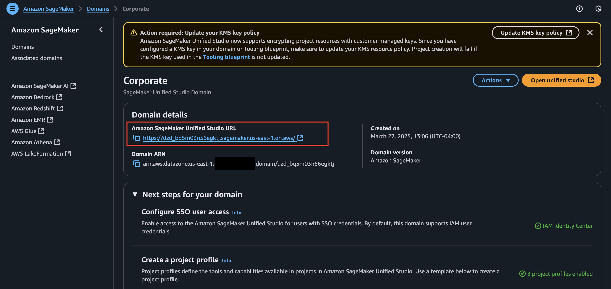

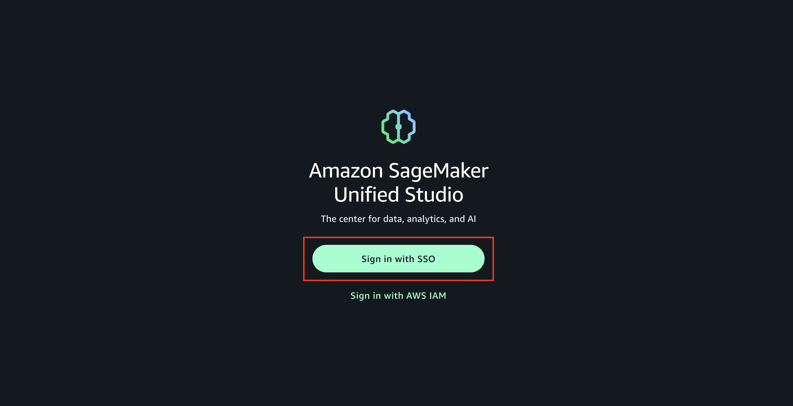

- Login using domain owner username and password
  - If you are logging into the domain owner for the first time, reset the password by navigating to IAM Identity Center > "Users" > domain user > "Reset Password"

  
  
  - Select "Generate a one-time password and share the password with the user" > "Reset Password" 
  
  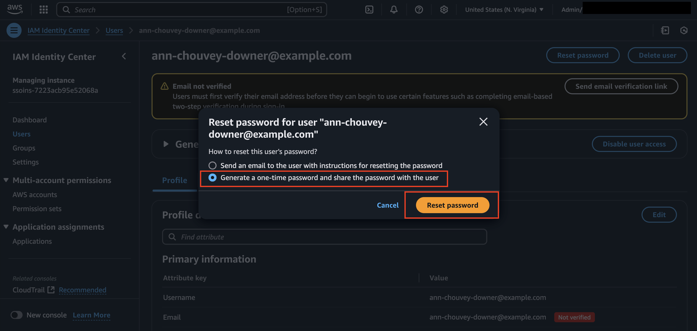
  
  - Copy one-time generated password > "Close"

  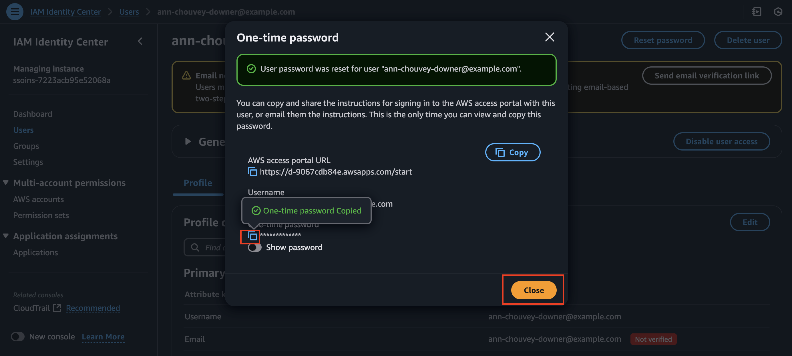
  
  - Navigate back to SageMaker Unified Studio and login with the generated password 

- Select the domain that matches our SageMaker Unified Studio domain 

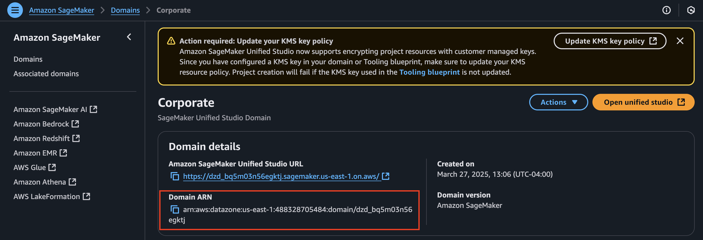

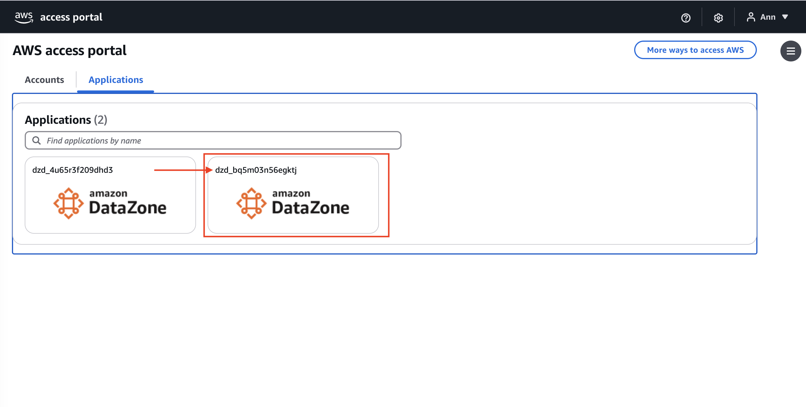

- You should see the main dashboard of SageMaker Unified Studio domain once logged in 

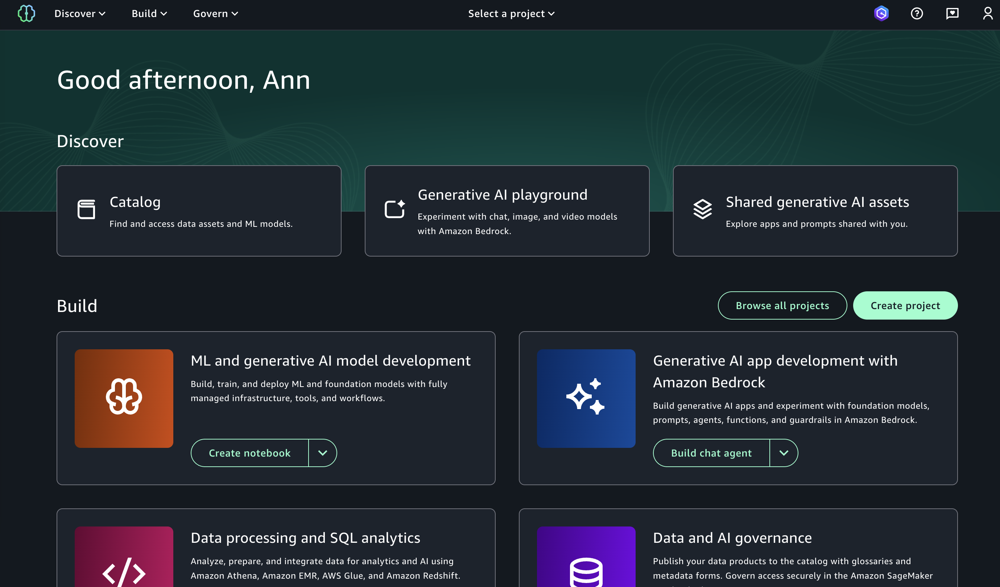

## DataZone Domain (`Exchange`)

### 1. DataZone Domain Overview 
- Navigate to "Domains" from the left navigation panel, select "Exchange"

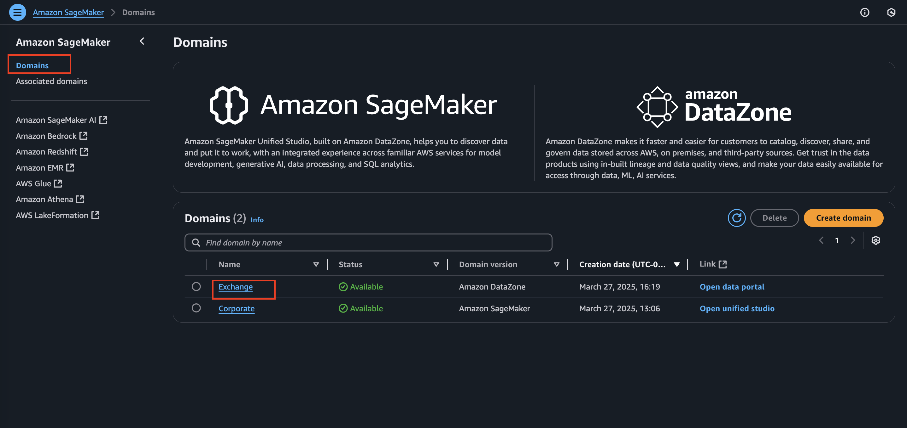

- Within the main domain dashboard of DataZone, you can find the following information: 
  - Domain access URL
  - IAM Identity Center ARN 
  - Domain ARN 

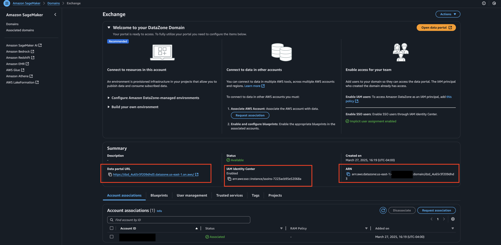

- You can also see what are the created projects within the domain by navigating to "Projects" portion 

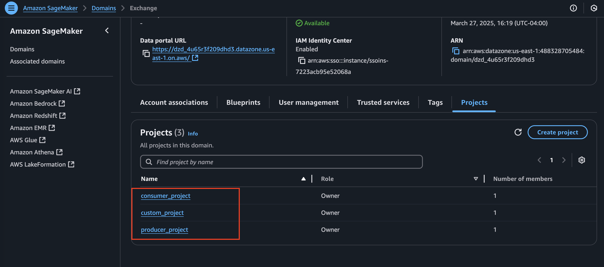

- Other domain settings mirror several key components found in SageMaker Unified Studio domains:

| Component | Purpose                                                                |
|-----------|------------------------------------------------------------------------|
| Access Control | Manages user permissions and resource access within the domain         |
| Blueprints | Provides templates for standardizing data workflows and configurations |
| User Management | Controls user access and roles through IAM Identity Center integration |
| Trusted Services | Defines which AWS services can interact with the domain                |
| Tags | Enables resource organization and management through key-value pairs   |

### 2. Sign into DataZone 

- Navigate to the Domain URL

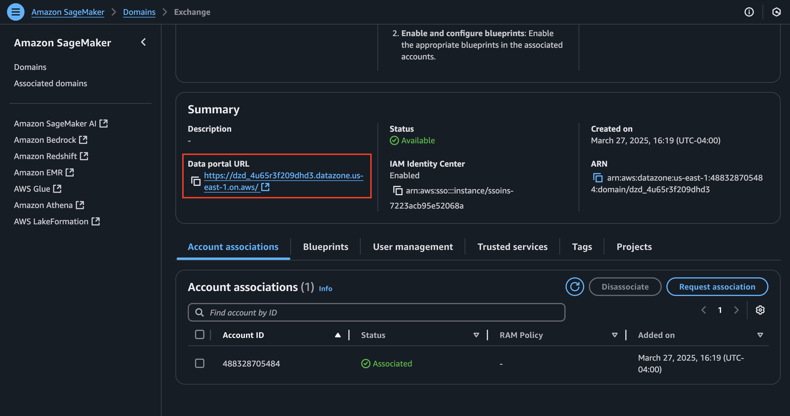

- You should see the main dashboard of DataZone domain once logged in

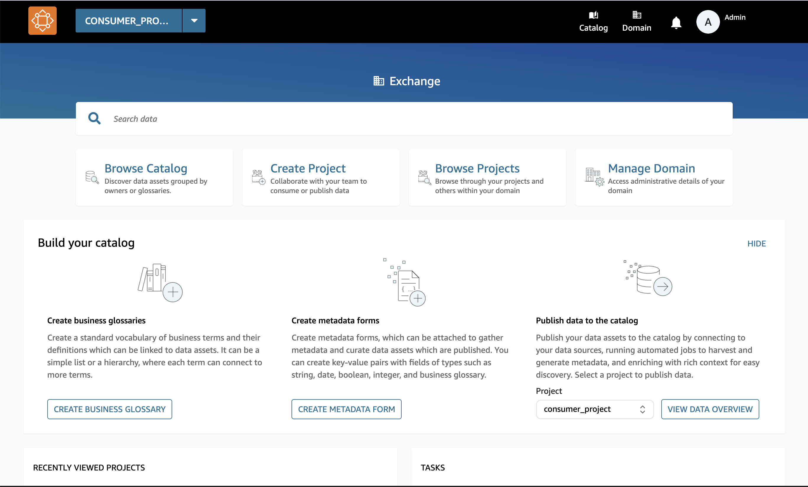

## Next Steps
- Explore [Project Management](exploring-daivi-sus-project.md)
- Learn about [Data Lineage](exploring-daivi-sus-lineage.md)
- Review security configurations
- Set up monitoring

## Reference Information
Related IaC: 
- `iac/roots/sagemaker`
- `iac/roots/datazone`

---

*Note: This guide focuses on navigating and understanding your deployed QuickSight configuration. For any changes to the configuration, please refer to the Infrastructure as Code documentation and follow the established change management process.*
