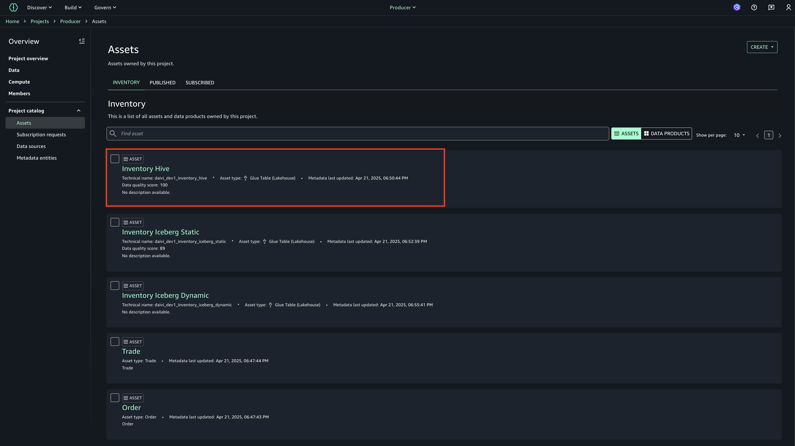
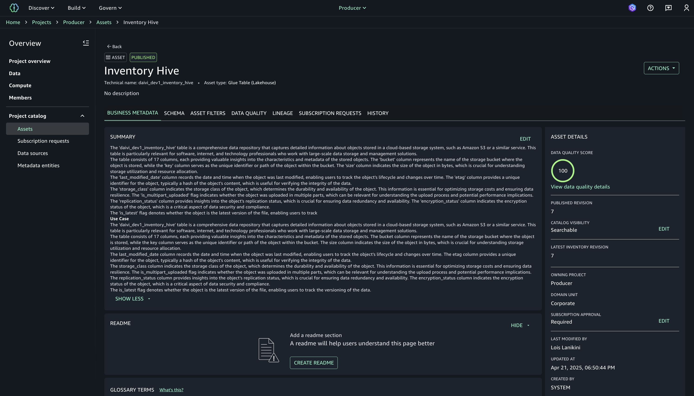
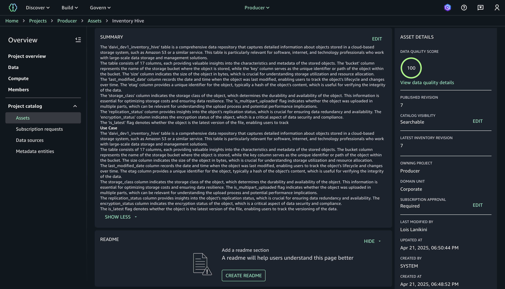
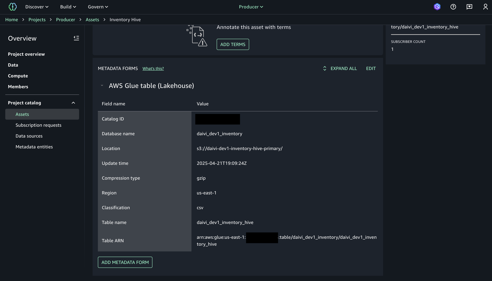
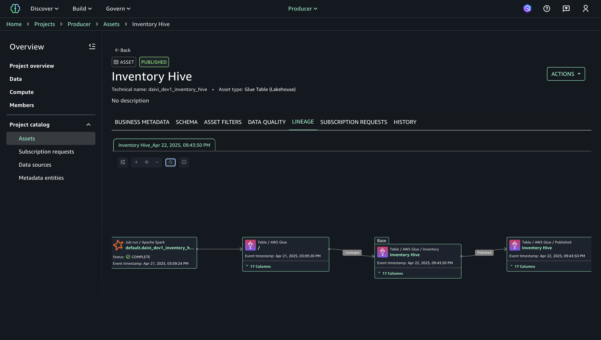
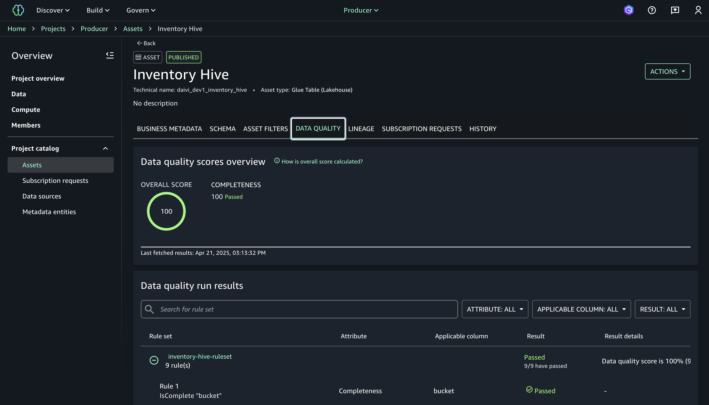
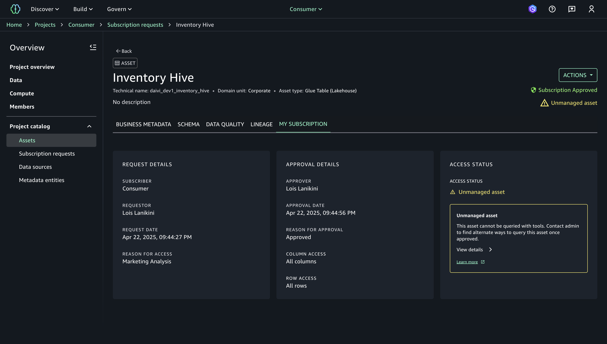
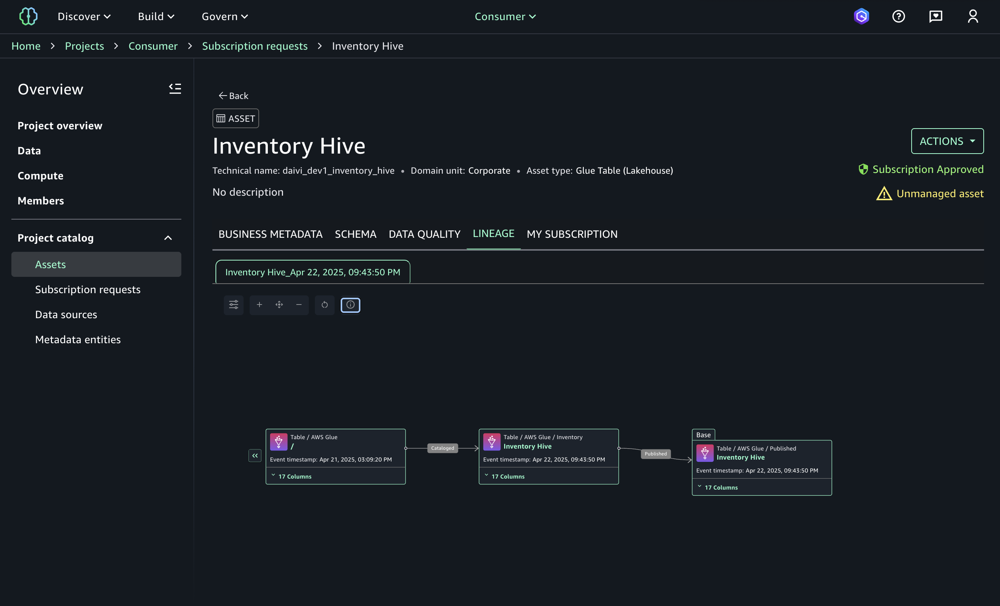

# Data Lineage in SageMaker Unified Studio

## Overview
Data lineage is a critical aspect of SageMaker Unified Studio that provides visibility into how data moves through your organization's data ecosystem. Understanding data lineage helps with data governance, compliance, troubleshooting, and establishing trust in data assets. This guide demonstrates how to use data lineage features within SageMaker Unified Studio to track and visualize the flow and transformation of your data.

## Prerequisites
- Successfully deployed SageMaker Unified Studio domains
- Basic understanding of project management in SUS (see [Project Management guide](exploring-daivi-sus-projects.md))
- Logged into SageMaker Unified Studio as a **project user**
- Access `Corporate` domain > `Consumer` project

## Accessing Data Lineage

### 1. Navigate to Asset Details
- Navigate to "Project catalog" > "Assets" in the left navigation panel
- Select the asset you would like to view (e.g., "Inventory Hive")

- Review the overview of the asset 

### 2. Asset Overview
- The asset detail page provides comprehensive information about the selected data asset:
  - Technical name and domain unit
  - Asset type (e.g., Glue Table)
  - Subscription status
  - Management status

### 3. Metadata Forms 
- Metadata Forms of an asset are:
  - Simple forms that add business context to asset metadata, enabling better data discovery and consistency in the catalog
  - Support standardized field types (boolean, date, decimal, integer, string, business glossary) for structured metadata collection
  - Can be applied individually to specific assets or automatically through data source runs for bulk asset processing

## Understanding Lineage Visualization

### 1. Lineage Graph Interface
- The lineage view displays a directed graph showing relationships between data assets
- Assets are represented as nodes in the graph
- Data flow relationships are shown as directional arrows between nodes
- The current asset is highlighted as the focal point in the graph

### 2. Node Information
- Each node in the lineage graph contains critical information:
  - Asset type (e.g., Table, AWS Glue)
  - Asset name (e.g., "Nearest Public Infrastructure 4 Inhibition Hive")
  - Event timestamp indicating when the relationship was established
  - Column count showing data structure complexity
  - Publication status (if applicable)

### 3. Relationship Types
- **Base**: Shows the source/origin relationship
- **Published**: Indicates the asset has been published and made available for consumption
- Additional relationship types may include:
  - **Derived**: For assets created from transformations
  - **Dependent**: For assets that rely on the current asset

## Exploring Data Quality in Context

### 1. Data Quality Tab
- Navigate to the "DATA QUALITY" tab to view quality metrics related to the asset
- The quality scores provide confidence in the lineage information

### 2. Quality Scores
- Overall score: Aggregate quality assessment (e.g., 100/100)
- Completeness: Measures data field population
- Data quality run results: Detailed breakdown of quality checks

### 3. Rule Sets
- View rule sets applied to the data asset:
  - Rule names and descriptions
  - Applicable columns
  - Pass/fail results
  - Quality score details (e.g., "9/9 have passed")

## Managing Asset Subscriptions

### 1. Subscription Details
- A project can subscribe to assets from other project 
- In this example, we would show you how to review and manage a subscription from "Consumer" project that subscribes to an asset (e.g., "Inventory Hive") in "Producer" project
- First, switch to "Consumer" project. Then, navigate to the "MY SUBSCRIPTION" tab to view subscription information
- Review the subscription approval process and status

### 2. Request Information
- View detailed information about the subscription request:
  - Subscriber (consumer project)
  - Requestor name
  - Request date and time
  - Access justification (e.g., "Marketing Analysis")

### 3. Approval Details
- Review the approval process information:
  - Approver name
  - Approval date and timestamp
  - Approval reason
  - Access permissions (columns and rows)

### 4. Access Status
- Monitor the current access status for the asset
- Identify any issues preventing proper access:
  - Unmanaged asset warnings
  - Required administrative actions
  - Alternative access methods

## Analyzing Asset Metadata

### 1. Business Metadata
- Access the "BUSINESS METADATA" tab for descriptive information
- Review business context and use cases for the data asset:
  - Purpose and significance
  - Target users (e.g., Cloud Storage Administrators, Data Analysts)
  - Compliance and regulatory relevance

### 2. Schema Information
- The "SCHEMA" tab provides detailed information about data structure
- View AWS Glue table metadata:
  - Catalog ID
  - Database name
  - Table location and ARN
  - Compression type and region
  - Classification format

## Best Practices for Data Lineage

### 1. Regular Lineage Review
- Periodically review data lineage to ensure data flow integrity
- Verify that all relationships accurately represent actual data transformations
- Check for broken or outdated lineage connections

### 2. Documentation Integration
- Use the lineage visualization to enhance documentation
- Reference lineage patterns when explaining data transformations
- Include lineage screenshots in data governance documentation

### 3. Impact Analysis
- Leverage lineage information for change impact analysis
- Before modifying data assets, review downstream dependencies
- Communicate changes to teams using dependent assets

## Troubleshooting and Common Issues

### 1. Unmanaged Assets
- When assets display "Unmanaged asset" warnings:
  - Contact administrators to establish proper management
  - Review data source configurations
  - Verify that data catalogs are properly registered

### 2. Missing Lineage
- If lineage connections are missing:
  - Check if data transformations are being properly logged
  - Verify that asset relationships are correctly registered
  - Review data pipeline configurations

### 3. Access Issues
- For access problems with lineage information:
  - Ensure subscription approvals are completed
  - Verify appropriate roles and permissions
  - Check domain and project configurations

## Next Steps 
- Implement governance policies based on lineage insights
- Establish lineage verification as part of data quality processes
- Configure automated alerts for lineage changes or breaks

## Reference Information
Related IaC:
- `iac/roots/sagemaker`
- `iac/roots/datazone`

---

*Note: This guide focuses on navigating and understanding data lineage in SageMaker Unified Studio. For configuration changes, refer to the Infrastructure as Code documentation and follow established change management processes.*
