# Project Management in SageMaker Unified Studio

## Overview
After exploring the domain structure of SageMaker Unified Studio, we'll now dive into project management capabilities. Projects in SUS provide collaborative workspaces for data science and ML teams to organize their data, compute resources, and assets in a structured environment. This guide walks through the key components of project management within SageMaker Unified Studio.

## Prerequisites
- Successfully deployed SageMaker Unified Studio domains
- Completed all domain management setup steps from the previous guide
- Logged into SageMaker Unified Studio as a **project user**
- Access `Corporate` domain in SageMaker Unified Studio

Note: For detailed SSO login instructions using IAM Identity Center, refer to [Section 3 - Sign into SageMaker Unified Studio Domain](exploring-daivi-sus-domain.md) in the previous guide

## Project Structure

### 1. Project Overview
- Navigate to SageMaker Unified Studio main interface
- Select "Projects" from the top navigation bar
- Choose your project (e.g., "Producer")

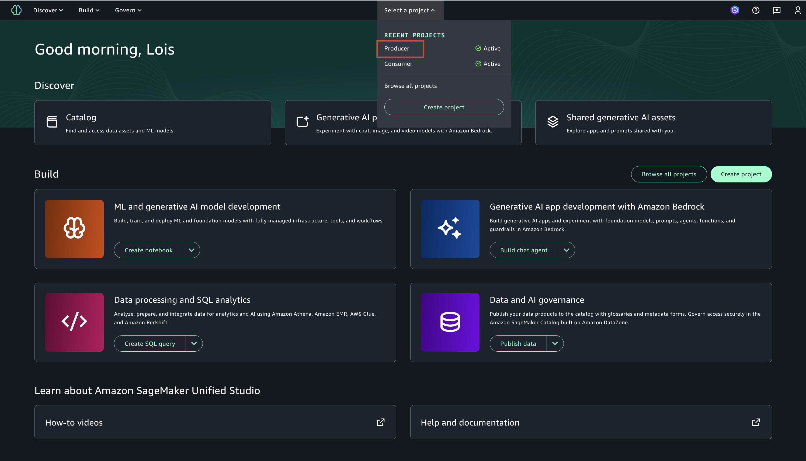

- The project overview provides essential information about your project:
  - Project name and description
  - Repository information and branch details
  - Project files including notebooks, code, and documentation
  - README content for quick reference

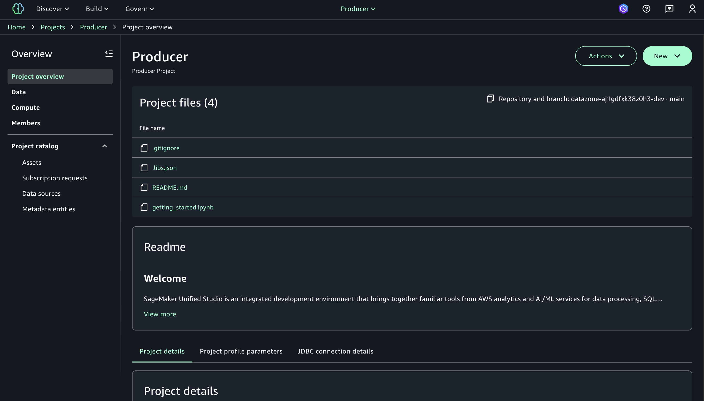

### 2. Project Details
- Access detailed project information through the "Project details" tab
- Key information includes:
  - Project name: The human-readable name for your project
  - Project ID: Unique identifier (e.g., `b77cmkzkpfae1z`)
  - Last modified: Timestamp of recent changes
  - Amazon S3 location: Storage location for project artifacts
  - Status: Current state of the project (e.g., Active)
  - Domain ID: Identifier for the parent domain
  - Creation date: Project initialization timestamp
  - Project role ARN: IAM role used for project operations
  - Created by: User or service that created the project
  - Project profile name: Applied capabilities profile (e.g., "All capabilities")
  - Domain unit name: Organizational unit (e.g., "Corporate")

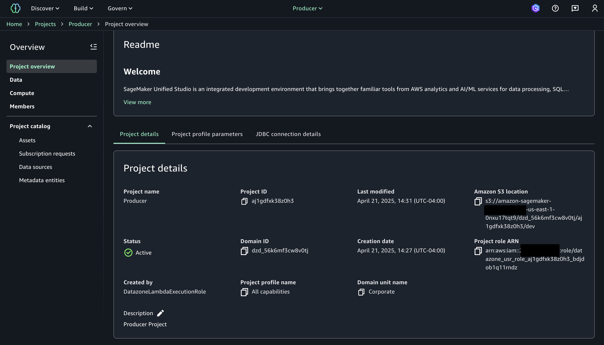

### 3. Project Profile Parameters
- Each project utilizes configuration parameters based on its profile
- These parameters control integrations with AWS services and resource provisioning
- Example parameters include:
  - Database connections (e.g., `glueDbName`: finance)
  - Workgroup configurations (e.g., `workgroupName`: workgroup)
  - LakeHouse database settings

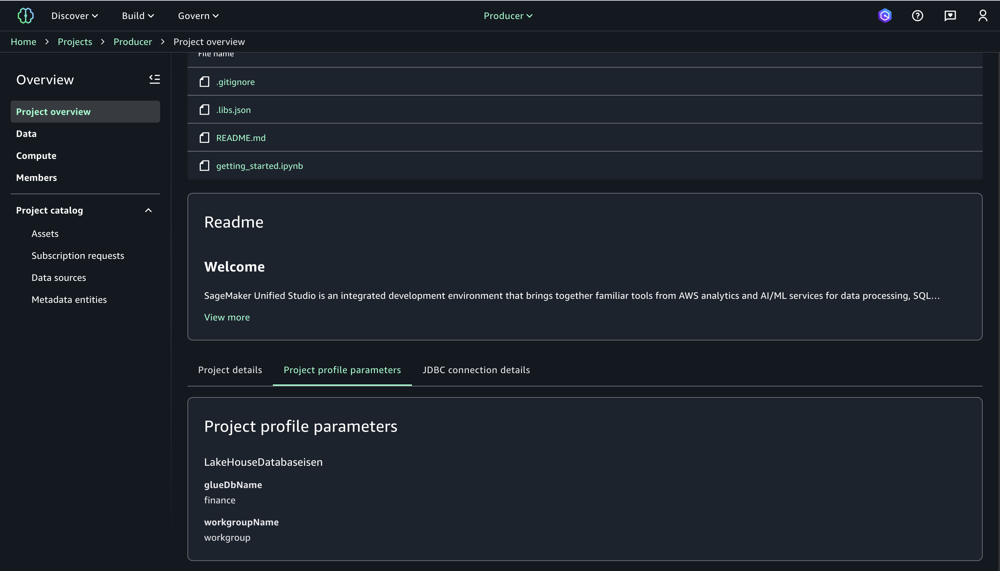

### 4. JDBC Connection Details
- Projects include database connectivity information for external applications
- Connection details are available in both IDC authentication and IAM authentication formats
- Key information includes:
  - JDBC URL for direct connection
  - Domain ID for resource identification
  - Environment ID for context reference
  - Region information
  - IDC issuer URL for authentication

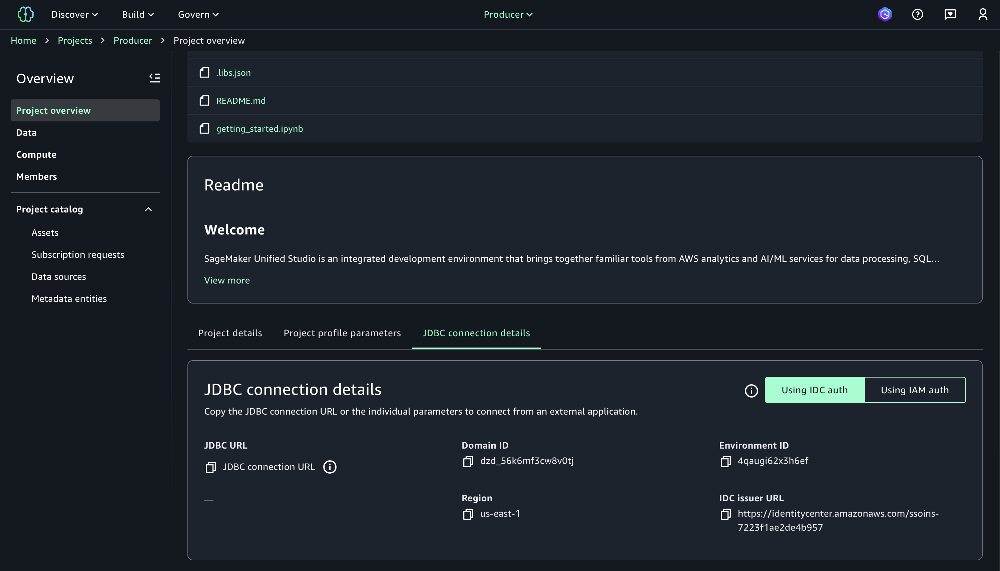

## Data Management

### 1. Data Catalog Access
- Navigate to "Data" section in the left navigation panel
- Browse available data sources organized by catalog type:
  - Lakehouse
  - Redshift
  - S3

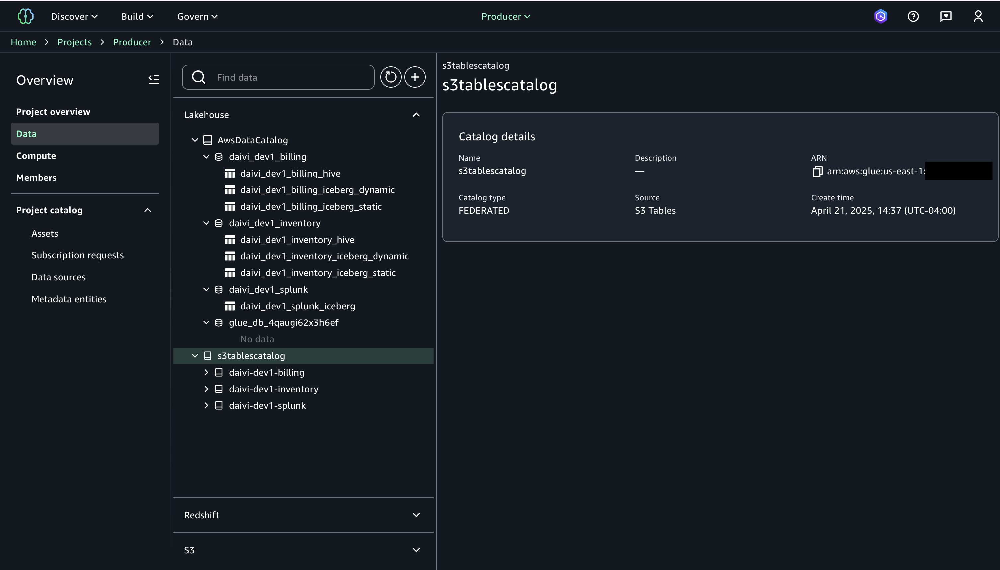

- Select a catalog to view detailed information:
  - Catalog description and connection identifier
  - Authorization mode (e.g., PROJECT)
  - Provisioning type (e.g., MANAGED)
  - Connection type (e.g., Redshift Serverless)
  - Credential type (e.g., Federated user)
  - JDBC URLs and permissions

### 2. Database Explorer
- Navigate through database hierarchies to explore schemas and tables
- Database structures are presented in a familiar tree format:
  - Redshift databases with dev/project/public schemas
  - AWS Glue Data Catalog with database objects
  - S3 buckets organized by project and domain

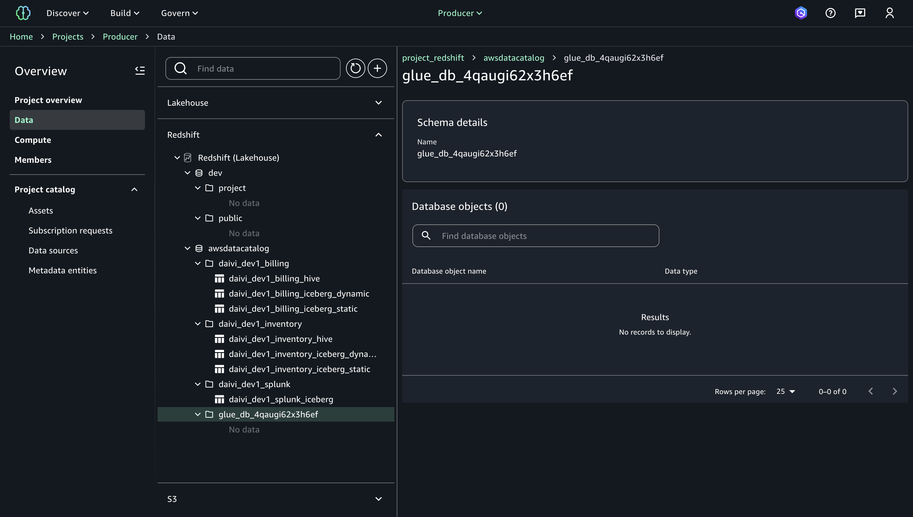

- Database objects can be examined for schema details and other metadata

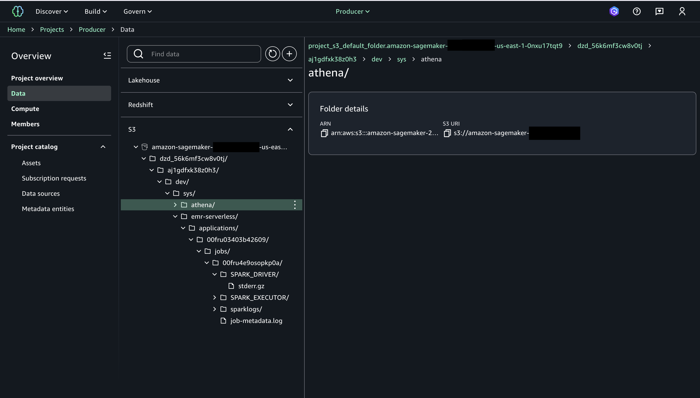

## Compute Resources

### 1. Data Warehouse Management
- Navigate to "Compute" section in the left navigation panel
- Select "Data warehouse" tab
- View and manage Redshift Serverless instances:
  - Status indicators (Active/Available)
  - Creation dates and deployment information
  - Resource names and types

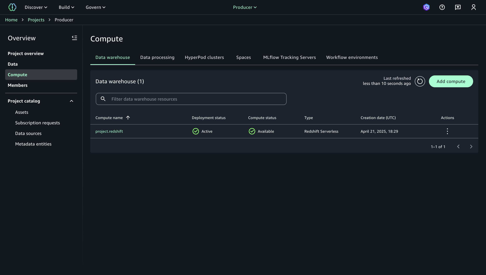

### 2. Data Processing
- Select "Data processing" tab to manage ETL resources
- View Glue ETL jobs with:
  - Compatibility modes (Standard/Fine-grained)
  - Status indicators
  - Creation timestamps
  - Permission models

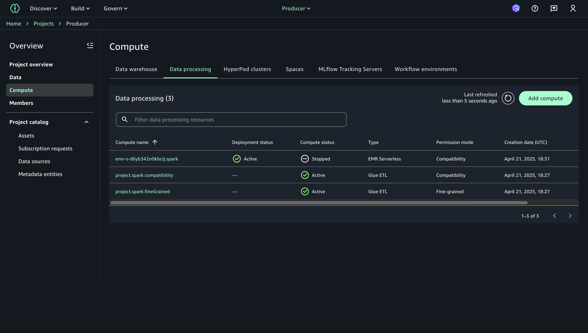

### 3. Spaces Management
- Select "Spaces" tab to manage JupyterLab environments
- Control interactive development environments with:
  - Status monitoring (Running/Stopped)
  - Application type (JupyterLab)
  - Last modified timestamps
  - Access controls (Private/Shared)
  - Configuration options

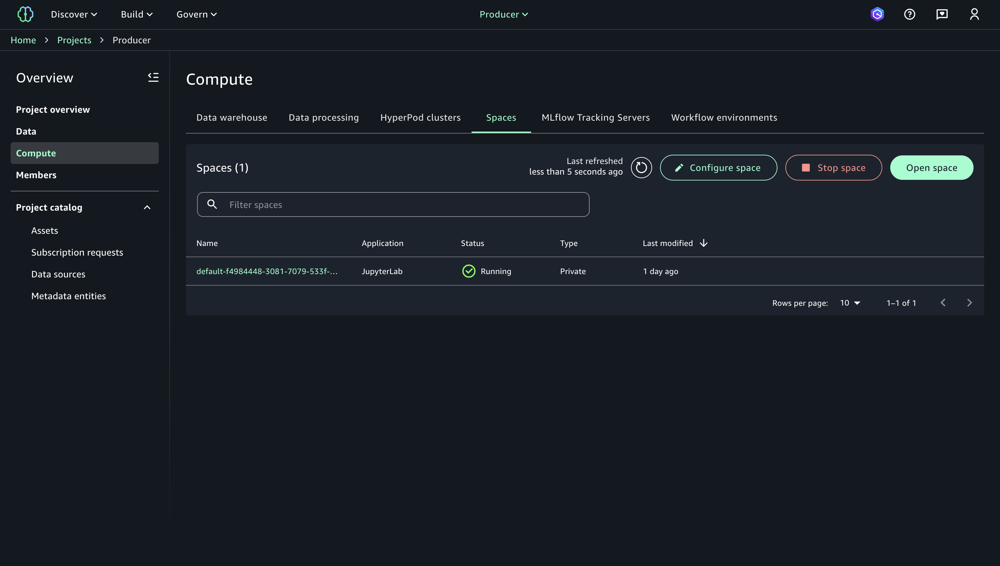

## Collaboration & Access Control

### 1. Members Management
- Navigate to "Members" in the left navigation panel
- View and manage project collaborators:
  - User details and roles (Owner/Contributor)
  - Remove or adjust permissions
  - Add new members (up to 20 per project)

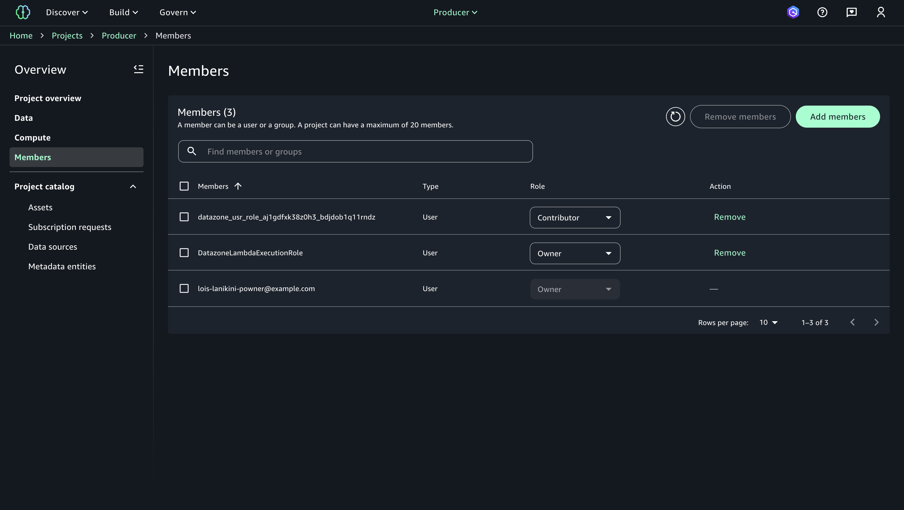

## Asset Management

### 1. Project Assets
- Navigate to "Project catalog" > "Assets" in the left navigation
- View assets organized by:
  - Inventory (owned assets)
  - Published (assets shared with others)
  - Subscribed (assets from other projects)

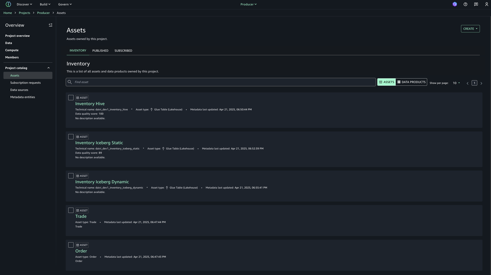

- Asset details include:
  - Asset type and source
  - Last update timestamps
  - Management status
  - Description and metadata

### 2. Subscription Requests
- Navigate to "Project catalog" > "Subscription requests"
- Manage incoming and outgoing data access requests
- Track request status:
  - Requested
  - Approved
  - Rejected
  - Revoked
  - Unsubscribed

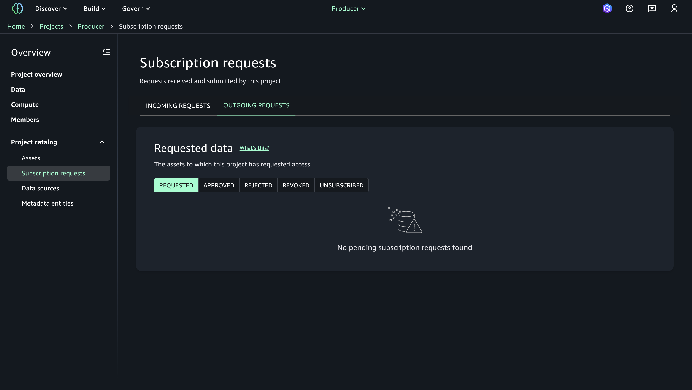

### 3. Data Sources
- Configure and monitor data sources for project assets:
  - Source types and connections
  - Refresh schedules
  - Status indicators
  - Last run timestamps
- Sources include:
  - Redshift connections
  - AWS Glue Data Catalog
  - SageMaker model package groups

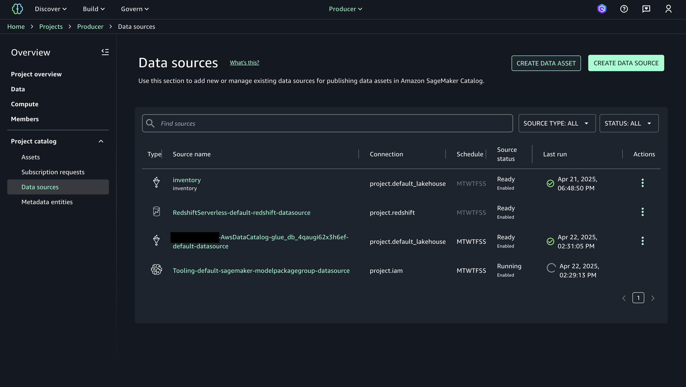

## Data Lineage

SageMaker Unified Studio maintains comprehensive data lineage tracking that allows users to:
- Visualize data flow between assets
- Trace data origins and transformations
- Understand dependencies between datasets
- Monitor impact of changes across the data pipeline

For detailed information on data lineage capabilities, refer to the dedicated [Data Lineage documentation](exploring-daivi-sus-lineage.md).

## Next Steps
- Explore detailed [Data Lineage](exploring-daivi-sus-lineage.md) capabilities
- Set up automated data workflows
- Configure data quality monitoring
- Implement project governance policies

## Reference Information
Related IaC:
- `iac/roots/sagemaker`
- `iac/roots/datazone`

---

*Note: This guide focuses on navigating and understanding your deployed QuickSight configuration. For any changes to the configuration, please refer to the Infrastructure as Code documentation and follow the established change management process.*
