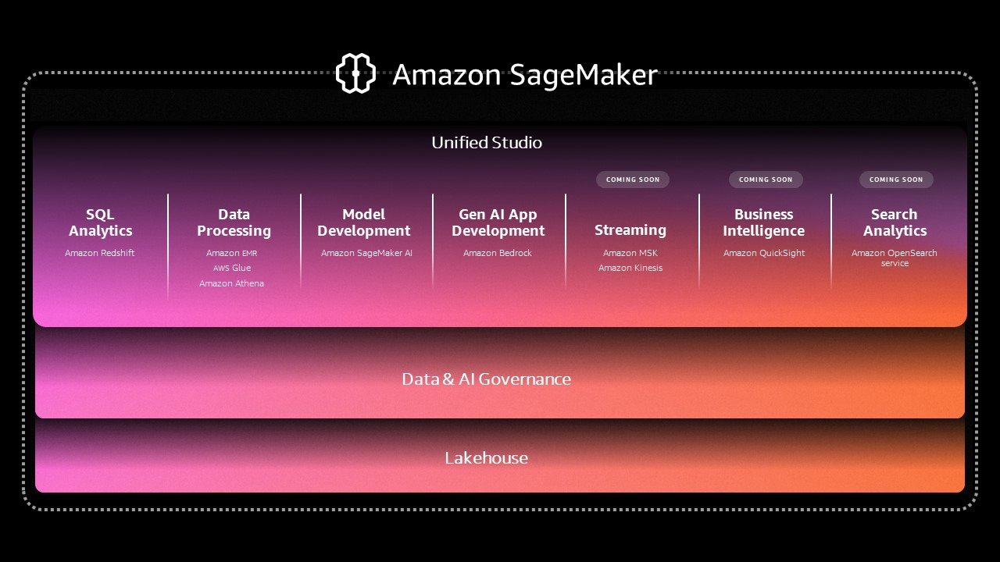

# Amazon SageMaker Unified Studio 

### Introduction 
Amazon SageMaker Unified Studio is a unified experience for data, analytics, and AI. Bringing together widely-adopted AWS machine learning and analytics capabilities, the next generation of SageMaker delivers an integrated experience for analytics and AI with unified access to all your data. Collaborate and build faster from a unified studio using familiar AWS tools for model development, generative AI, data processing, and SQL analytics, accelerated by Amazon Q Developer, the most capable generative AI assistant for software development. Access all your data whether it’s stored in data lakes, data warehouses, third party or federated data sources, with governance built-in to address enterprise security needs.

### Capabilites 

| Feature Capability | Description |
|-------------------|-------------|
| Amazon SageMaker Unified Studio (Preview) | Build with all your data and tools for analytics and AI in a single environment. |
| Amazon SageMaker Lakehouse | Unify data access across Amazon S3 data lakes, Amazon Redshift, and federated data sources with Amazon SageMaker Lakehouse. |
| Data and AI Governance | Securely discover, govern, and collaborate on data and AI with Amazon SageMaker Catalog, built on Amazon DataZone. |
| Model Development | Build, train, and deploy ML and FMs with fully managed infrastructure, tools, and workflows with Amazon SageMaker AI. |
| Generative AI App Development | Build and scale generative AI applications with Amazon Bedrock. |
| SQL Analytics | Gain insights with the most price-performant SQL engine with Amazon Redshift. |
| Data Processing | Analyze, prepare, and integrate data for analytics and AI using open-source frameworks on Amazon Athena, Amazon EMR, and AWS Glue. |

### Key Components of Amazon SageMaker Unified Studio

**1. Domain**

A Domain in Amazon SageMaker Unified Studio is a high-level organizational unit that encapsulates all the resources and settings for a group of users. It serves as a container for user profiles, projects, and shared resources. When you create a domain, you define the VPC, security groups, and other network configurations that apply to all the users within that domain.

*Key Features:*
- Centralized management of user profiles and permissions
- Network and security configurations applied uniformly across the domain
- Resource sharing and collaboration within the domain

**2. Project**

A Project in SUS is a collaborative workspace where teams can work together on machine learning and data analytics tasks. Projects allow you to organize your work into logical units, making it easier to manage and share resources among team members.

*Key Features:*
- Template-based project creation for common use cases
- Collaboration tools for team members to share notebooks, datasets, and models
- Version control and experiment tracking within projects

**3. Subscription**

Subscriptions in Amazon SageMaker Unified Studio refer to the licensing and access models for various AWS services integrated within SUS. Subscriptions allow users to access premium features and services, ensuring they have the necessary tools for their machine learning and analytics workflows.

*Key Features:*
- Access to AWS services like Amazon Redshift, Amazon Athena, and more
- Tiered subscription models based on usage and requirements
- Integration with AWS Marketplace for additional tools and solutions

**4. Data Quality**

Data Quality features in SUS help ensure that the data used for machine learning and analytics is accurate, consistent, and reliable. Data quality tools provide capabilities for data profiling, cleansing, and validation.

*Key Features:*
- Automated data profiling to identify anomalies and inconsistencies
- Data cleansing tools to correct errors and standardize formats
- Data validation rules to ensure data meets quality standards before use

**5. Data Lineage**

Data Lineage in SUS tracks the origin and transformation of data throughout its lifecycle. This feature is crucial for maintaining data governance, ensuring compliance, and providing transparency in data workflows.

*Key Features:*
- Visual representation of data flow from source to destination
- Tracking of data transformations and processing steps
- Audit trails for data changes and updates

**6. Model Development**

SUS provides comprehensive tools for Model Development, allowing data scientists and machine learning engineers to build, train, and deploy models efficiently.

*Key Features:*
- Integrated Jupyter notebooks for experimentation and coding
- Automated machine learning (AutoML) to streamline model building
- Model training and hyperparameter tuning capabilities

**7. Generative AI**

Generative AI capabilities in SUS leverage advanced algorithms to create new data, insights, and solutions. This includes natural language processing, image generation, and other creative applications of AI.

*Key Features:*
- Pre-trained models for various generative tasks
- Custom model training for specific generative applications
- Integration with Amazon Q Developer for enhanced generative AI assistance

**8. Data Processing**

Data Processing tools in SUS enable users to clean, transform, and prepare data for analysis and machine learning. These tools support both batch and streaming data processing.

*Key Features:*
- Apache Spark-based data processing frameworks
- SQL-based data transformation using Amazon Athena
- Integration with AWS Glue for ETL workflows

**9. SQL Analytics**

SUS offers robust SQL Analytics capabilities, allowing users to query and analyze data using standard SQL. This feature integrates with various data sources, including data lakes and warehouses.

*Key Features:*
- Querying data lakes and warehouses using Amazon Athena
- Real-time analytics capabilities

**10. Amazon Q Developer**
Amazon Q Developer is the generative AI assistant within SUS, designed to enhance software development and machine learning workflows. It provides intelligent code suggestions, documentation, and best practices.

*Key Features:*
- AI-driven code completion and suggestions.
- Contextual documentation and explanations.
- Best practice recommendations for coding and model development.

To learn more: 
- [Amazon SageMaker Unified Studio](https://aws.amazon.com/sagemaker/)

