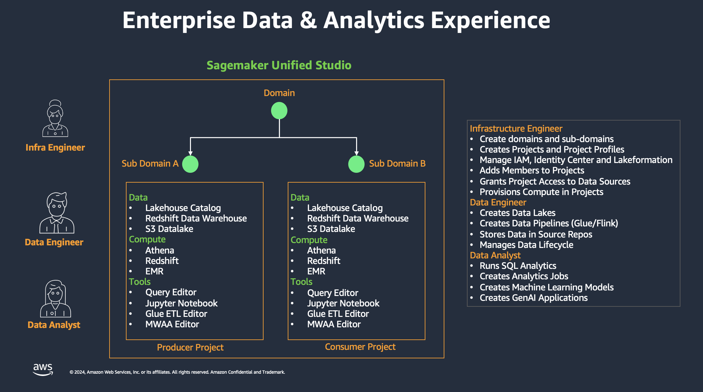
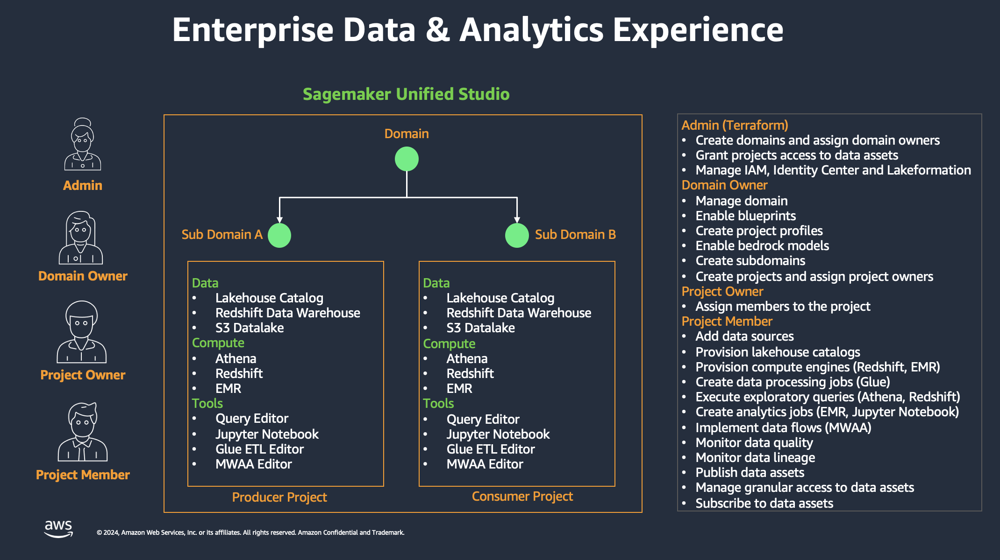

# Design Approach

## Project Background
Nexus was contextualized from a cost analytics use case. The clients were asking for a batch data pipeline that is stored in an Ice Berg data lake, in which cost data comes from three major sources:
- AWS Cost & Usage Report
- AWS S3 Inventory
- Splunk operational data

The requirements from the clients' use case also entail:
- **Collaboration**:
  - Collaborate as a team
  - Grant team access to data it needs
  - Privileged and standard access
- **Analyze and share**:
  - Personal scratchpad for the team
  - Analyze data as a team
  - Curate data assets and share
  - Govern access to data assets
- **Secure Data**:
  - Minimize attack surface
  - Prevent data exfiltration

Understanding the requirements, Nexus is designed with several core principles in mind to ensure a robust, secure, and scalable cost data and analytics platform. These principles are tailored to meet the needs of different personas within the organization, ensuring that each user has the appropriate level of access and capabilities.

## Key Personas
We will design the experience from the view of three personas:
- **Infra Engineer:** Responsible for provisioning core cloud infrastructure using Infrastructure as Code (IaC) to support Data Engineers and Data Analysts.
- **Data Engineer:** Uses IaC, Python, and Spark to provision cloud and data infrastructure. May use SageMaker for data exploration or creating data processing jobs, which are later codified as Terraform and deployed through the pipeline.
- **Data Analyst:** Primarily works within SageMaker using Python and Spark. Does not handle IaC but may collaborate with Data Engineers for specific tasks.

## Core Principles

### IaC vs. Unified Studio
- Decisions on whether to implement features through IaC or directly in SageMaker Unified Studio (SUS) are crucial.
- IaC ensures the environment can be recreated in another AWS account, promoting consistency and scalability.

### Version Control
- All code and configurations are stored in a version control system
- Enables recreation of the entire environment in a different AWS account

### Management Console Access
- Data analysts are not granted access to the AWS Management Console to maintain security and control over environment changes

### Non-Versioned SUS Access
- Data personas with access to SUS are restricted from making configuration changes not stored in version control
- They can make code changes, such as in Jupyter Notebooks, which are version-controlled

### SDLC Lifecycle
- AWS accounts are designated for specific stages:
    - Development
    - Testing
    - Production
- Domains in SUS are promoted from lower to higher environments using version-controlled information

### Version Control of SUS Projects
- Projects in SUS are configured to use a GIT repository:
    - Standard repository provided by SUS, or
    - Custom repository

### Data Persona Access
- Access granted based on roles
- Ensures users can perform duties without exceeding privileges

### Least Privilege
- Each data persona is granted the minimum level of access necessary to perform their tasks

### Roles in SUS

- Supported roles:
    - Admin
    - Domain Owner
    - Project Owner
    - Project Contributor
- All data personas are mapped to the Project Contributor role to limit configuration change capabilities

### Access to Data Sources

#### Administrator Responsibilities
- Configures data sources (e.g., S3 buckets, databases)
- Grants appropriate access levels using:
    - IAM Identity Center
    - Lake Formation

#### Project S3 Bucket
- Each SUS project includes a dedicated S3 bucket
- Access granted to data personas based on their roles
- Follows least privilege principle

#### Identity Center Integration
- All SUS access managed through AWS Identity Center
- Provisioning and configuration implemented via IaC
- Access granted to groups, not individual users
- Supported groups:
    - Admin
    - Domain Owner
    - Project Owner
    - Project Contributor
- Users added to Project Contributor group for specific project access

#### IAM Role Integration
- Users in Project Contributor group receive least-privileged IAM roles
- Roles correspond to data personas:
    - Data Analyst
    - Data Engineer
- Ensures appropriate access levels for each role

#### Lake Formation Integration
- Configured with role associated with SUS project
- Enables fine-grained access control to data lakes
- Maintains security and compliance requirements
